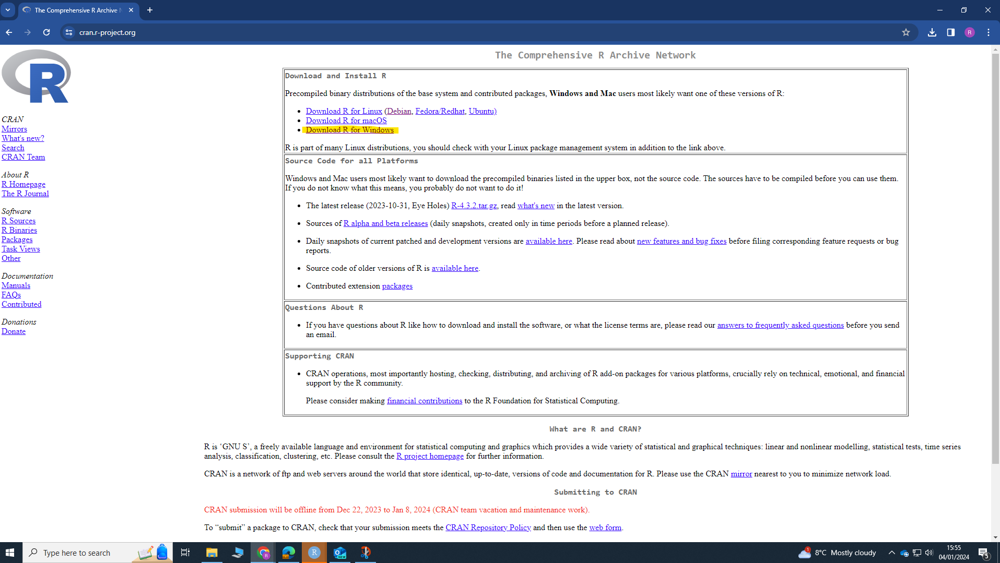
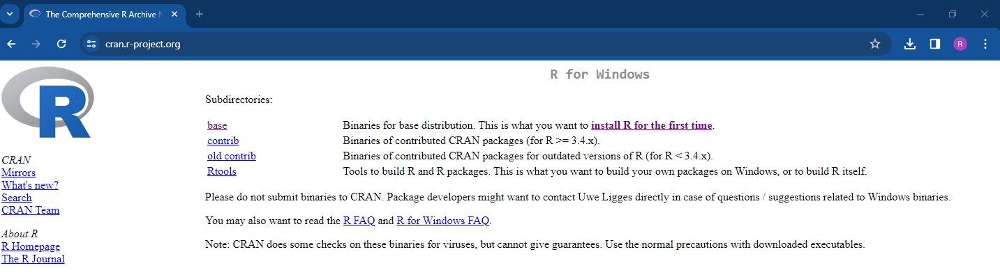
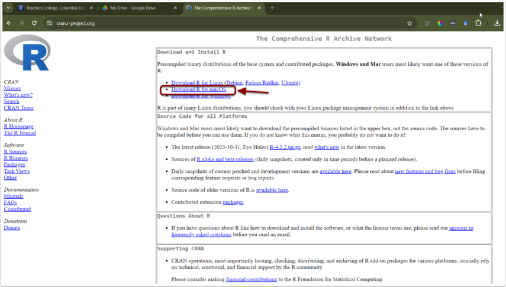
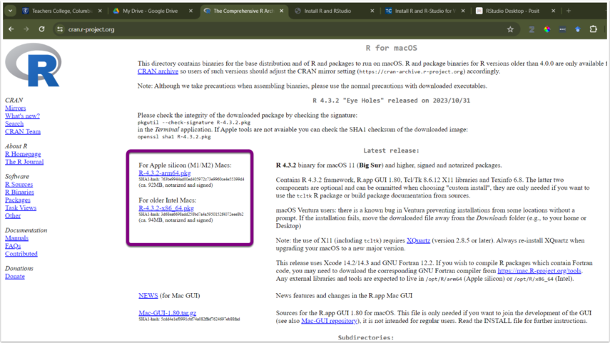
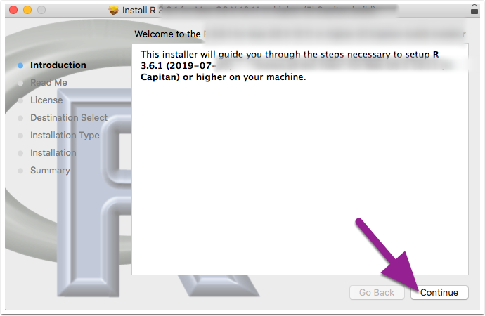
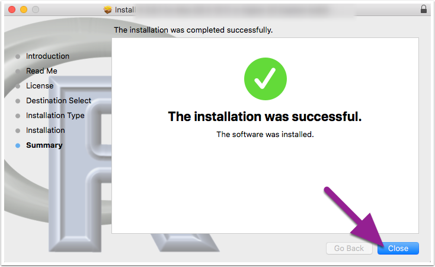
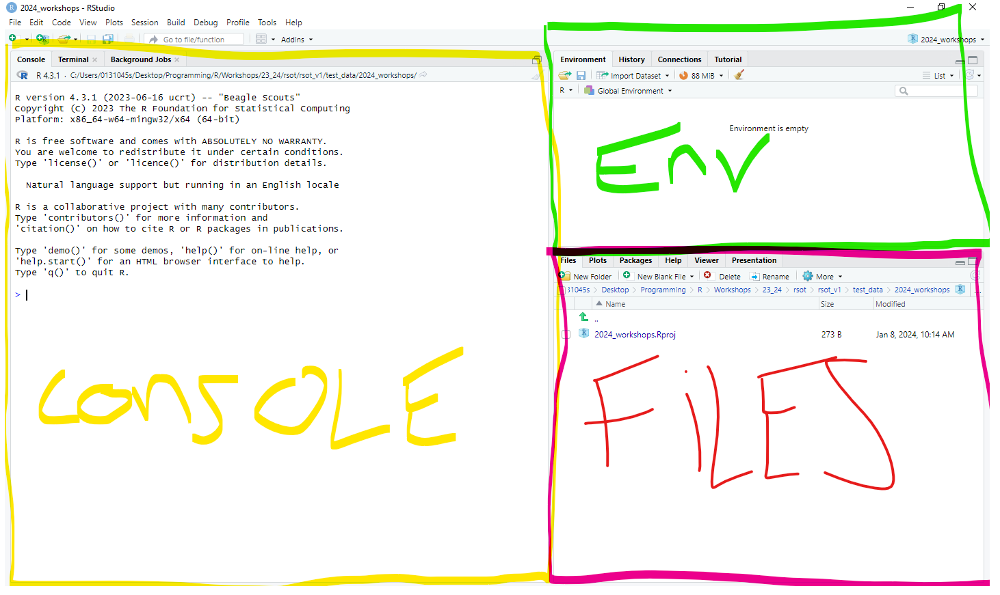
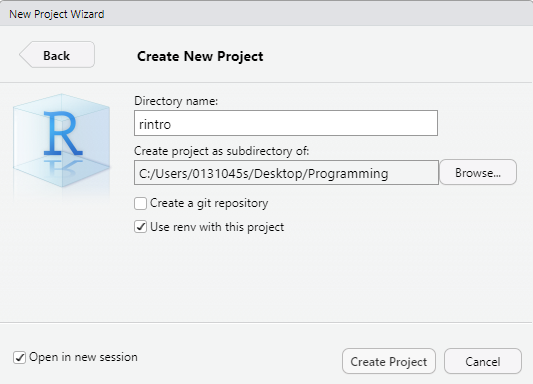
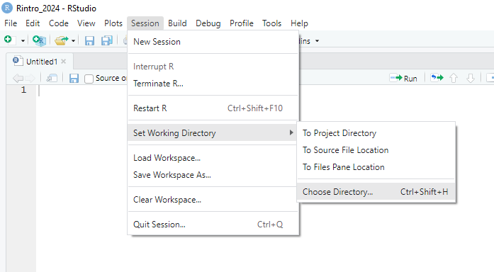
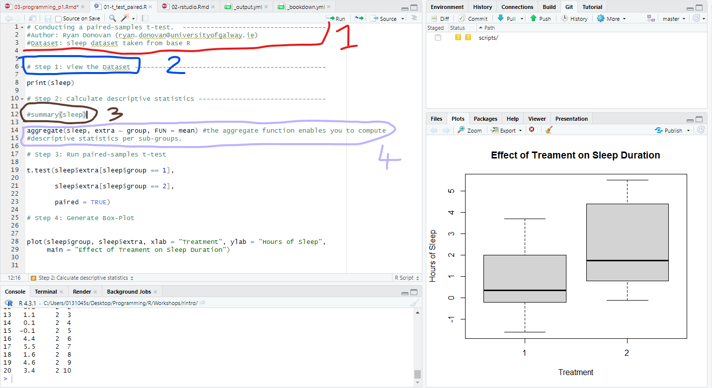

---
output:
  html_document: default
  word_document: default
---

# **Getting Started with R and RStudio** {#rstudio}

This workshop introduces the programming language R and the RStudio application. Today, we will download both R and RStudio, set up our RStudio environment, and write and run our first piece of R Code. This will set us up for the rest of the workshops.

## What is R?

R is a statistical programming language that enables us to instruct our computer directly to perform tasks. Typically, when we use our computers, we do not speak to them directly; instead, we interact with "translators" (i.e., applications like SPSS) via button-click interfaces to communicate with our computers on our behalf. These interfaces record and translate our instructions to our computers, which then carry out the instructions and return the results to the application, which then translates those results back to us.

Applications like SPSS are convenient. They usually have a user-friendly button-click-based interface and take away the heavy lifting of communicating with our computer. This makes them significantly easier to learn in the short term compared to programming languages.

However, these apps also limit what we can do. For example, base SPSS is functional when it comes to creating visualizations, but it is difficult to make major changes to your graph (e.g., making it interactive). If we want to create such visualizations, we will likely need to look elsewhere for it. Similarly, we might also be financially limited in our ability to use such apps, as proprietary software like SPSS is not cheap ([it can cost between \$3830 - 25200 for a single licence depending on the version](https://www.ibm.com/products/spss-statistics/pricing))!

In contrast, R is a free, open-source statistical programming language that enables us to conduct comprehensive statistical analysis and create highly elegant visualizations. By learning R, we can cut out the middleman.

```{r fig.cap = "BBC graphs created in R.", echo = FALSE, warning = FALSE}

library(knitr)

include_graphics("img/01-bbc.png")


```

But why should we learn R and not a different programming language? In contrast to other programming languages (Python, JavaScript, C), R was developed by statisticians. Consequently, R contains an extensive vocabulary to enable us to carry out sophisticated and precise statistical analysis. I have used R and Python to conduct statistical analysis, and anytime I wanted to use a less frequently used statistical test, there was significantly more support and information on how to conduct that analysis in R than in Python. For such reasons, R is typically used among statisticians, social scientists, data miners, and bioinformaticians - and will be used in this course[^02-rstudio-1].

[^02-rstudio-1]: There are always tradeoffs in selecting a language. Many programming concepts are easier to grasp in Python than in R. Similarly, there is a lot of resources available for conducting machine-learning analysis in Python.

    But if you are goal is conduct data cleaning, analysis, visualization, and reporting, then R is a excellent choice. The good thing is that once you achieve a certain level of competency in one programming language, you will find it significantly easier to pick up a following one.

## Create a Posit Cloud Account.

In the next section, I am going to show you how to download R and RStudio on your desktop. But before we do that, I want you to set up a free account on Posit Cloud (formerly known as RStudio Cloud).

Posit Cloud enables you to use R and RStudio online for free, no need to install anything. There are limitations to this service (you only get so many hours on it with the free account), and I much rather you use your own computers in class. But it will be a handy back-up option in case any technical issues pop up. During class, I might not be able to solve that issue quickly and efficiently, so if it does occur, then you can sign in to Posit Cloud and keep following along with the session.

To create a Posit Cloud account, please follow the following instructions:

1.  [Go to their sign up page website](https://login.posit.cloud/register?redirect=%2Foauth%2Fauthorize%3Fredirect_uri%3Dhttps%253A%252F%252Fposit.cloud%252Flogin%26client_id%3Dposit-cloud%26response_type%3Dcode%26show_auth%3D0) and enter your details to create an account or Sign up with Google.

    ```{r echo = FALSE}

    include_graphics("img/01-posit-sign-up.png")

    ```

2.  Once you have created an account and are in Posit Cloud, click "New Project" From the drop-down menu click "New RStudio Project". This should take a few seconds to set up (or "deploy")

```{r echo=FALSE}

include_graphics("img/01-posit-newproject.png")

```

1.  Once it is deployed, name your project at the top as ***rintro***

```{r echo=FALSE}
include_graphics("img/01-posit-rintro.png")
```

Don't worry about what anything on the screen means for now. We'll come back to that once we download RStudio on your computer. For now, you can sign out of Posit Cloud.

## Downloading R on to your Computer

Please follow the following instructions to download R on either Windows or Mac.

### Downloading R on Windows

1.  Go to the website: <https://cran.r-project.org/>
2.  Under the heading *Download and Install R,* click *Download R for Windows*

```{r echo = FALSE}

```

3.  Click the hyperlink ***base*** or ***install R for the first Time***

```{r echo = FALSE}

```

4.  Click Download R-4.3.2 for Windows (depending on the date you accessed this, the version of R might have been been updated. That's okay, you can download newer versions). Let the file download.

```{r fig.cap = "The R programming language is occasionally updated, so the specific version of R that you see might be different than mine. But that\'s okay!", echo = FALSE}


```

5.  Once the file has been downloaded, open it, and click "Yes" if you are asked to allow this app to make changes to your device. Then choose English as your setup language. The file name should be something like "R-4.3.2.-win". The numbers will differ depending on the specific version that was downloaded.
6.  Agree to the terms and conditions and select a place to install R. It is perfectly fine to go with the default option.

### Downloading R on Mac

The instructions are largely the same for Mac.

1.  Go to the website: <https://cran.r-project.org/>

2.  Click Download R for (Mac) OS X.

```{r echo=FALSE}



```

1.  Check the Latest release: section for the appropriate version and follow the directions for download. If you are unsure about this, please ask me.

```{r echo=FALSE}



```

1.  Once the file download is complete, click to open the installer. Click Continue and proceed through the installer, I recommend going with all default options.

```{r fig.cap= "Depending on your version of Mac OS, this might look slightly different. But you should still be able to install it.", echo=FALSE}



```

1.  Once the R installer has finished, click Close.

```{r echo=FALSE}



```

## Install and Open R Studio

Once R is installed, we will install RStudio.

RStudio is a user-friendly front-end program for R, enhancing your R coding experience without sacrificing any capabilities. RStudio allows us to write and save R code, create plots, manage files, and perform other useful tasks. Think of RStudio as similar to Microsoft Word compared to a basic text editor; while you can write a paper in a text editor, it's much quicker and efficient in Word.

1.  **NB:** Make sure that R is installed ***before*** trying to install R Studio.
2.  Go to the RStudio website: <https://posit.co/download/rstudio-desktop/>
3.  The website should automatically detect your operating system. Click the ***Download RStudio Desktop*** button.

```{r echo = FALSE}
include_graphics("img/01-rstudiodownload.png")
```

Once the file is downloaded, open it and allow it to make changes to your device. Then follow the instructions to download the program. I recommend using all the default options during installation.

After downloading both R and RStudio, open RStudio on your computer. You do not have to open R separately, as RStudio will work with R if everything is set up correctly.

When you first open RStudio, you will see three panes or "windows" in RStudio: "Console" (left), "Environment" (top right), and "Files" (bottom right).

```{r echo = FALSE}



```

## Creating an R Project

Our first step in RStudio is to create an *R Project*. R Projects are environments that group together input files (e.g., data sets), analyses on those files (e.g., code), and any outputs (e.g., results or plots). Creating an R Project will set up a new directory (folder) on your computer. Whenever you open that project, you are telling R to work within that specific directory.

***Activity***

Let's create an R Project that we will use during these workshops.

1.  Click "File" in the top left hand corner of RStudio-\> then click new "New Project"

2.  The "New Project Wizard" screen will pop up. Click "New Directory" -\> "New Project"

3.  In the "Create New Project" screen, there are four options we are going to change.

**Option 1**: The "Directory name" options sets the name of the project and associated folder.

-   You can set this to whatever you want. ***Just don't set it to "R",*** as this can create problems down the line.

-   I ***recommend*** that you set the same directory name as me - ***rintro***

**Option 2**: The "Create project as sub-directory of" option selects a place to store this project on your computer.

-   You can save it anywhere you like (e.g., your Desktop). Just ensure it's in a place you can easily find and where it won't be moved (e.g., if you save folders to your desktop but tend to relocate them later, avoid saving it on your desktop).

-   My recommendation is to create a folder called "R_Programming" on your desktop and save your project inside this folder.

-   Regardless of where you save your project, copy the location and keep it in a place you can check later (e.g., in a text file).

**Option 3**: The "Use renv with this project" option enables you to create a virtual environment for this project that will be separate to other R projects. Don't worry for now about what that means, it will be explained later on.

-   Tick this option.

**Option 4:** The "Open in new session" just opens a new window on RStudio for this project.

-   Tick this option.

**Note on Github Repository**: This will probably not appear on your RStudio project, but that's okay, you don't need it for this course.

You can see my example below. Once you're happy with your input for each option, click "Create Project" This will open up the project ***rintro***.

```{r fig.cap = "New Project Set Up", echo = FALSE, warning = FALSE}

library(knitr)




```

### Navigating RStudio

In our new project, ***rintro***, we are going to open the "Source" pane, which we will often use for writing code, and viewing datasets.

There are a variety of ways to open the Source pane.

**Button approach**: Click the "File" tab in the top-left hand corner (not the File pane) -\> Click "New File" -\> "R Script"

```{r echo = FALSE}
include_graphics("img/rstudio_create_file.png")
```

***Button Shortcut***: directly underneath the *File* tab, there is an icon of a white sheet with a green and white addition symbol. You can click that too.

**Keyboard Shortcut:** You can press "Ctrl" + "Shift" and "N" on Windows. Or "Cmd" + "Shift" + "N" on Mac.

Now you should see your four panes: Source, Console, Environment, and Files.

```{r echo = FALSE}

include_graphics("img/01-four-panes.png")

```

#### The RStudio Workspace

With each pane opened, let's briefly describe their purposes.

-   The ***Source Pane*** is where you will write R scripts. R scripts enable you to write, save, and run R code in a structured format. For instance, you might have an R script titled "Descriptive," containing the code for computing descriptive statistics on your data set. Similarly, you might have another R script titled "Regression" for performing regression analyses in R.

-   The ***Console Pane*** is where you can write R code or enter commands into R. The console is also where you can find various outputs from your R scripts. For example, if you create a script for running a t-test in R, the results will appear in the Console Pane. Any error or warning messages related to your code will also be highlighted in the console. In short, the console is where R actually runs.

-   The ***Environment Pane*** contains information about data sets and variables imported or created in R within a specific R project. The "History" tab shows a history of the R code executed during the project. This pane is helpful for getting an overview of a project, especially if you return to it after a long time or are reviewing someone else's code.

-   The ***Files Pane*** includes your R project files (Files tab), the output of any plots you create (Plots tab), the status of downloaded packages (Packages tab), and information about R functions and packages (Help).

All four panes will be used extensively during these workshops.

### Checking our Working Directory

Every time you open a project or file in RStudio, it's good practice to check the working directory. The working directory is the environment on your computer where R is currently operating.

Ideally, you want the working directory to match the location of your R project. This ensures that any files you import into RStudio or any files you export (datasets, results, graphs) can be easily found in your R project folder. Checking the working directory can help prevent many common R problems. To check the working directory, type the following into the console pane:

```{r}
getwd()
```

This will display the current working directory where R is operating. Your working directory will likely differ from mine, which is normal. Just confirm that it matches the location you specified when creating your project (**Option 2**).

### Setting up a new Working Directory {#set_wd}

We are going to slightly change our working directory. In our R Project, we are going to create a folder for week1 of the workshop. Anything that we create in R will then be saved into this week1 folder.

-   Click "Session" on your RStudio toolbar -\> Set Working Directory -\> Choose Directory

```{r echo = FALSE}



```

-   By default you should be in your R Project (e.g., ***rintro***).

-   Within this R Project, create a new folder and call it "week1"

-   Click "week1" and then click Open

```{r echo=FALSE}

include_graphics("img/01-new_wd.png")

```

You should see something like the following in your console

```         
> setwd("C:/Users/0131045s/Desktop/Programming/R/Workshops/rintro/week1")
```

Check whether this is actually the location you want to store your files for this course. If it is, we are good to go. If not, then let me know.

## Writing our first R Code

Let's write our first line of R code in the console. The R console uses the prompt symbol \> to indicate that it is ready for a new line of code.

Type in each of the following instructions (after the \> operator) and press enter. Feel free to change the second line of code to add your own name.

```{r first piece of code}

print("Hello World")

print("My name is Ryan and I am learning to code in R")

```

Congratulations, you've written your first piece of code!

Let's describe what is going on here. We used a function called print() to print the words "Hello World" and "My name is Ryan, and I am learning to code in R" in the console. Functions are equivalent to verbs in the English language - they describe doing things. In this case, R sees the function print - then it looks inside the bracket to see what we want to print, and then it goes ahead and prints it. Pretty straightforward.

Functions are a very important programming concept, and there is a lot more going on under the hood than I have described so far - so we will be returning to functions repeatedly and filling you in with more information. But in essence, functions are verbs that enable us to tell our computer to carry out specific actions on objects.

## Console vs Source Script

You might have noticed that I asked you to write code in the console rather than in the source pane. It's worth discussing here what the differences are between the console and the script when it comes to writing code.

The console is like the immediate chat with R. It's where you can type and execute single lines of code instantly. Imagine it as a friendly conversation where you ask R to perform a task, and it responds immediately. The console is great for experimenting and getting instant feedback. It's your interactive playground, perfect for spontaneous interactions with R.

The console is also really useful for performing quick calculations, testing functions or pieces of code, and for running code that should run once and only once.

However, the console is cumbersome to use if we want to write code that is several lines long and/or when we want to structure or save our code. This is where R scripts come in.

R scripts are text files where we can write R code in a structured manner. Scripts enable us to structure our code (e.g., with headings and instructions), write several pieces of code, and save and rerun code easily. If you think of your console as a draft, then your script is for the code that you want to keep.

From now on, whenever we write code, we are going to be using R scripts by default. For the times we will write code in the console, I will let you know beforehand.

## Let's write some statistical code {#firstpieceofcode}

Okay, we have talked a lot about R and RStudio. To finish off this session, let's write code that will take a data set, calculate some descriptive statistics, run an inferential test, generate a graph, and save our results. Don't worry if you don't understand all of the code provided below. Just follow along and type it yourself in the R script we opened up earlier (if it's not open, click "File" -\> "New File" -\> "RScript"). Once you have created this script, save it as "01-paired-t-tests".

When you download R, you will have automatic access to several functions (e.g., print) and data sets. One of these data sets is called sleep, which we are going to use right now. To learn more about the sleep data set, type **`?sleep`** into the console. You will find more information on the data sets in the Files pane, under the Help tab.

First, let's have a look at the sleep data set by writing the following code in the R script. To run scripts in R, select the code you have written and click the Run button with the green arrow in the top right corner of the script.

```{r}

print(sleep) 

```

The **`print()`** function here prints out the sleep data set in the console. There are also other ways to view a data set, such as using the functions **`head()`**, **`tail()`**, **`View()`**, and **`str()`**. Type these in the console (make sure to put **`sleep`** inside the brackets) and see what results you get.

The result of **`print(sleep)`** shows us there are 20 observations in the dataset (rows), with three different variables (columns): extra (hours of extra sleep each participant had), group (which treatment they were given), and ID (their participant ID).

Now let's calculate some descriptive statistics. One way we can do this is by using the **`summary()`** function. This function takes in an object (e.g., like a data set) and summarizes the data. Write the following in your R script and press run.

```{r}

summary(sleep) 
```

Running **`summary(sleep)`** shows us descriptive statistics for each of our variables. We can see that the mean change in hours of sleep was +1.5, and that there were 10 participants in both the control and experimental condition.

But it's not exactly what we need. Firstly, we don't need summary descriptives on the participant ID. Secondly, it only tells us the mean of the entire sample, whereas we want the mean score for each treatment group. To get this information, we can use the **`aggregate()`** function, which enables us to split our data into subsets and then compute summary statistics per group. Remember to press run after you've written your code.

```{r}


#The code inside the aggregate bracket tells our computer to: 
# data = sleep -> Go to the sleep data set

#extra ~ group -> Take the variable "extra" and split it into subsets based on the variable "group"

# FUN = mean -> Apply the mean() function (FUN) on each subset 

aggregate(data = sleep, extra ~ group, FUN = mean)


```

That's more like it. Now we can see that there does seem to be a difference between treatment1 and treatment2. Participants slept an extra 2.33 hours on average when taking treatment 2, whereas they only slept 0.75 hours (e.g., 45 minutes) more on average when taking treatment 1. So, treatment 2 does seem more effective.

Let's run a paired-samples t-test to see if those differences are significant (I have assumed all parametric assumptions are correct).

```{r}

t.test(sleep$extra[sleep$group == 1], #this code extracts the group 1 scores
       sleep$extra[sleep$group == 2], # this code extracts group 2 scores
       paired = TRUE) #this code tells R to run a paired t-test, not between/independent t-test


```

Boom! We can see there is a statistically significant difference between the two groups. I know the code within the t-test might look a bit complicated, but we will break it down and explain it as we go on in further weeks.

Finally, let's visualize our data with the plot() function.

```{r fig.cap="Generic Boxplot"}

plot(sleep$group, sleep$extra)
```

The `plot()` function is an example of a generic function, which means it adapts to our code. In this case, the plot() function looks at the variables we want to plot and identifies that the box plot is the most appropriate way to plot it.

Now this plot is perfectly adequate for a first viewing, but let's make it a bit more instructive by adding labels to the x and y-axes, and by adding a title to it.

```{r fig.cap="Generic Boxplot with appropriate labelling"}


#xlab = creates a label for the x-axis  

#ylab = creates a title for the y-axis  

#main = creates a title for the plot  


plot(sleep$group, sleep$extra, xlab = "Treatment", ylab = "Hours of Sleep", main = "Effect of Treament on Sleep Duration")  


```

Now let's take this plot and save it to a PDF so that we can share our results with others. The standard way of doing this in R is a bit cumbersome. We have to tell R that we are about to create a plot that we want to make into a PDF. Then we have to generate the plot. Then we have to tell R we are done with creating the PDF. We'll learn a MUCH simpler way to do this in future weeks, but this will do for now.

```{r}

pdf(file = "myplot.pdf") #Tells R that we will create a pdf file called "my_plot" in our working directory

plot(sleep$group, sleep$extra, xlab = "Treatment", ylab = "Hours of Sleep", main = "Effect of Treament on Sleep Duration")  #this will save the plot to our pdf


dev.off() #this tells R that we are done with adding stuff to our PDF

```

Go to the files pane, and open up the pdf "myplot.pdf". It should be in your working directory. Open it up the PDF and have a look at your graph[^02-rstudio-2].

[^02-rstudio-2]: This is a fairly generic type of graph offered by base R. During the course we will looking at ways we can create "sexier" and more APA friendly type of graphs. But for one line of code, it's not bad!

### Comments

One last concept before we finish. You might have noticed that I wrote several things with a **`#`** before them. These are known as comments. Comments are any piece of text that will be ignored by R (i.e., they will not be executed within the console). They are fundamental to writing clear code.

We create comments using the **`#`** symbol. This symbol tells R to ignore whatever comes directly ***afterwards***.

There are various reasons for using comments.

```{r fig.cap = "Four Examples of Comments Use", echo = FALSE, warning = FALSE}

library(knitr)




```

In the above figure, you'll see four different types of comments.

1.  The first type of comment provides a quick introduction to the R script. It can be really useful here to provide clear information on what this script is trying to do (e.g., run a paired samples t-test), what data it is working on (the sleep dataset), and who wrote or developed this script. This makes it significantly easier for anyone who might be reviewing your work or trying to apply your code to their own work to understand what is going on.

2.  The second type of comment structures the format of the script by providing headings or steps. Again, this just makes it easier to understand what is going on.

3.  The third type of comment is placed before the summary. This means that the code **`summary(sleep)`** will not be executed in R. Why would we do this? If you remember last week, we wanted to compute the mean per each of our two treatment groups, which the summary function does not enable us to do, so it's not part of our main analysis. So why keep it? Well, it still provides us with valuable information (e.g., mean, median, min, max for the entire sample), so rather than delete it, we'll just put a comment in front of it. And if any time we want to check these descriptives, we can just remove the **`#`** and run that line of code.

4.  The fourth type of comment provides some context or information on what a specific line of code is doing, namely, what the **`aggregate()`** function does. Again, this is really useful, particularly if you are using functions that are not well-known.

Comments are extremely useful for orienting yourself to code. My advice would be to comment as much as your code as you. Anyone who has coded will have experienced the following situation - You spend days/weeks writing a piece of code to clean a messy data set and run a specialized type of analysis. Several months go by, and you need to return to your data set (pesky reviewer #2 wants you to change something). You open up your R script, and you are ***completely lost***. You have written no comments, so you have to spend days trying to remember what each piece of code was trying to do.

If you comment a lot, it will save you so much heartache in the future. And it will help you understand various code concepts better if you can explain them while you are using them. So comment, comment, comment!

## Summary

There we have it! That completes our first session with R and RStudio. Today was more about getting to grips with the software R and RStudio, but we still got our first pieces of code written. Hopefully, it's given you a tiny glimpse into what R can do.

In the next two sessions, we will learn basic programming concepts and how to import data in R.

## Glossary

This glossary defines key terms introduced in Chapter 2.

| Term                  | Definition                                                   |
|-----------------------|--------------------------------------------------------------|
| Comment               | Text in an R script that is ignored by R. Comments are preceded by the `#` symbol and are used to add explanations, headings, or disable code temporarily. |
| Console               | The interactive interface in RStudio where you can type and execute R commands and see their immediate output. |
| Environment Pane      | The pane in RStudio that displays information about data sets, variables, and the history of R commands used in the current R session. |
| Files Pane            | The pane in RStudio that displays the files and folders in your current working directory, as well as other useful tabs like Plots, Packages, and Help. |
| Function              | A fundamental programming concept in R, representing a reusable block of code that performs a specific task. Functions are like verbs in English; they describe actions. |
| R                     | A programming language and environment for statistical analysis and data visualization. |
| R Project             | An environment created in RStudio that groups together input files, code, and outputs. It helps organize and manage your work in a specific directory. |
| RStudio               | An integrated development environment (IDE) for R, providing a user-friendly interface and tools for coding, data analysis, and visualization. |
| Script                | A file containing a sequence of R commands that can be saved, executed, and reused. |
| Source Pane           | The pane in RStudio where you can write and edit R scripts. |
| Term                  | Definition                                                   |
| Working Directory     | The directory or folder on your computer where R is currently operating. It is important for managing file paths and organizing project files. |


