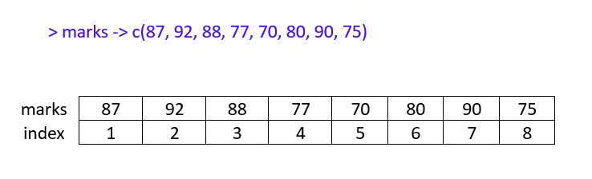
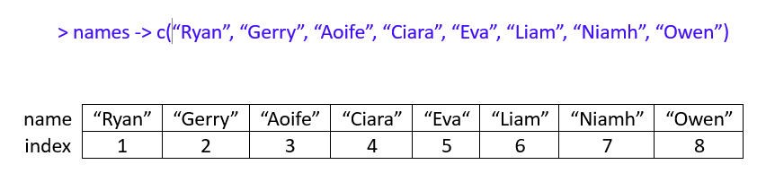
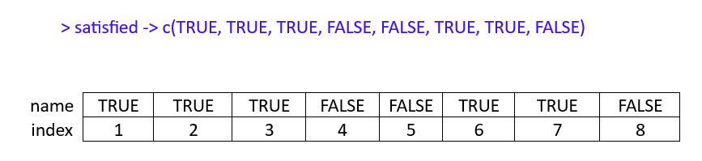
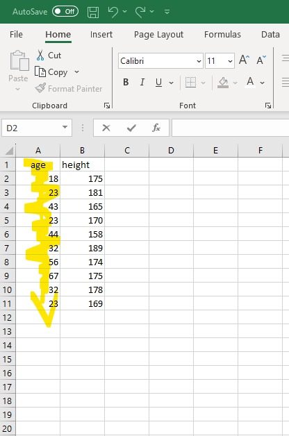
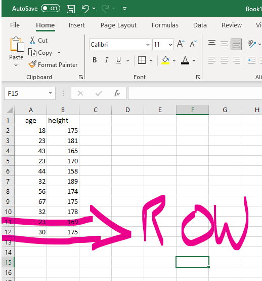
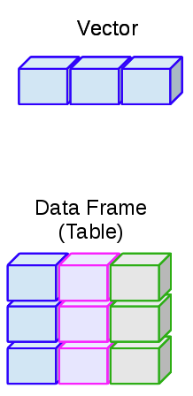

# **R Programming (Part I)** {#programming1}

Today, we are going to explore fundamental programming concepts in R. By the end of this session, you should be capable of the following:

-   Running and troubleshooting commands in the R console.
-   Understanding different data types and when to use them.
-   Creating and using variables, and understanding best practices in naming variables.
-   Grasping key data structures and how to construct them.

```{r echo=FALSE, warning=FALSE}

library(webexercises)

```

## Activity 1: Set up your Working Directory

It's good practice to set your working directory when you first open RStudio. Remember that the working directory is the location where we want to store any resulting data files or scripts that you'll work on in a session. Last week I showed you how to do this using [a button-and-click interface](#set_wd).

Using those instructions, create a folder called "Week2" in the `rintro` project folder and set it as your working directory.  Your output should be something like this:

```{r eval = F}

> setwd("C:/Users/0131045s/Desktop/Programming/R/Workshops/Example/Rintro_2024/week2")

```

Use the ´getwd()´ to check that it has been set as your working directory.

## Using the Console

In the previous chapter, I made a distinction between the script and the console. I said that the script was an environment where we would write and run polished code, and the R console is an environment for writing and running "dirty" quick code to test ideas, or code that we would run once.

That distinction is kinda true, but it's not completely true. In reality, when we write a script we are preparing ***commands*** for R to ***execute*** in the console. In this sense, the R script is equivalent to a waiter. We tell the waiter (script) what we want to order, and then the waiter hands that order to the chef (console).

It's important to know how to work the R console, even if we mostly use scripts in these workshops. We don't want the chef to spit on our food.

### Typing Commands in the Console

We can command the R console to perform calculations. When following along in RStudio, there's no need to type the `>` operator; it simply indicates that R is ready to execute a new command, which can be omitted for clarity.[^03-programming_p1-1]

[^03-programming_p1-1]: Including the "\>" is a pain when formatting this book, so I won't include "\>" in examples of code from this point forward.

```{r eval=FALSE}

> 10 + 20

[1] 30

```

```{r eval=FALSE}

> 20 / 10

[1] 2

```

When performing calculations in R, it's important to know that it follows the usual arithmetic convention of the order of operations (remember [BEDMAS - Bracets, Exponents, Division, Multiplication, Addition, and Subtraction?](https://www.tes.com/en-ie/teaching-resource/bidmas-bodmas-bedmas-bimdas-pemdas-permdas-11154272#:~:text=%E2%80%A2%20BIMDAS%20%2D%20Brackets%2C%20Indices%2C,Multiplication%2C%20Division%2C%20Addition%2C%20Subtraction)).

```{r eval = FALSE}


> (20 + 10 / 10) * 4 

[1] 84

> ((20 + 10) / 10) * 4

[1] 12

```

You may have noticed that the output of each code line we entered starts with a **`[1]`** before the actual result. What does this mean?

This is how R labels and organizes its responses. Think of it as having a conversation with R, where every question you ask gets an answer. The square brackets with a number, like **`[1]`**, serve as labels on each response, indicating which answer corresponds to which question. This is R ***indexing*** its answer.

In all the examples above, we asked R questions that have only 1 answer, which is why the output is always **`[1]`**. Look what happens when I ask R to print out multiple answers.

```{r}

print(sleep$extra) #this will print out the extra sleep column in the sleep dataset we used last week

```

Here R tells us that the first answer (i.e., value) corresponds to `0.1`. The next label is `[16]`. which tells us that the 16th answer corresponds to 4.4.

But why does it only show the `[1]` and `[16]`th index? If you run this code in your console, you might actually see a different number than `[16]` depending on wide your console is on your device.

This is because R only prints out the index when a new row of data is needed in the console. If there were indexes for every single answer, it would clutter the console with unnecessary information. So R uses new rows as a method for deciding when to show us another index.

We'll delve deeper into indexing later in this session; it's a highly useful concept in R.

### Console Syntax (Aka "I'm Ron Burgundy?")

#### R Console and Typos

One of the most important things you need to know when you are programming, is that you need to type *exactly* what you want R to do. If you make a mistake (e.g., a typo), R won't attempt to decipher your intention. For instance, consider the following code:

```{r eval=F}

> 10 = 20

```

```{r error = TRUE, echo = FALSE}

10 = 20

```

R interprets this as you claiming that 10 equals 20, which is not true. Consequently, R panics and refuses to execute your command. Now any person looking at your code would guess that since `+` and `=` are on the same key on our keyboards, you probably meant to type `10 + 20`. But that's because we have a strong theory of mind, whereas programming languages do not.

So be exact with your code or else be [Ron Burgundy?](https://www.youtube.com/watch?v=X3zfP14pLxc).

On the grand scheme of mistakes though, this type of mistake is relatively harmless because R will tell us immediately that something is wrong and stop us from doing anything.

However, there are silent types of mistakes that are more challenging to resolve. Imagine you typed `-` instead of `+`.

```{r eval= FALSE}

> 10 - 20

[1] -10

```

In this scenario, R will runs the code and produces the output. This is because the code still makes sense; it is perfectly legitimate to subtract 20 away from 10. R doesn't know you actually meant to add `10` to `20`. All it can see is three objects `10`, `-`, and `20` in a logical order, so it executes the command. In this relationship, you're the one in charge.

In short calculations like this, it's clear what you've typed wrong. However, if you have a long block of connected code with a typo like this, the result can significantly differ from what you intended, and it might be hard to spot.

The primary way to check for these errors is to always review the output of your code. If it looks significantly different from what you expected, then this silent error may be the cause.

I am not highlighting these issues to scare you, it's just important to know that big problems (R code not running or inaccurate results) can often be easily fixed by tiny changes.

#### R Console and Incomplete Commands

I've been pretty mean to the console, but there are rare times it will be a good Samaritan. For example, if R thinks you haven't finished a command it will print out `+` to allow you to finish it.

```{r eval = FALSE}

> (20 + 10
 
+ )

[1] 30

```

So when you see "+" in the console, this is R telling you that something is missing. R won't let you enter a new command until you have finished with it.

```{r eval = FALSE}

(20 + 10

+ #if I press enter, it will keep appearing until I finish the code
+
+
+
+

```

If nothing is missing, then this indicates that your code might not be correctly formatted. To break out of the endless loops of "+", press the ***Esc*** key on your keyboard.

### Exercises

1.  Practice performing basic calculations in R console. Calculate the following:
    1.  25 multiplied by 4
    2.  72 divided by 8 3
    3.  0 multiplied by 4, and then divided by 2
2.  Imagine you want to calculate the average/mean of the following 5 numbers 15, 22, 18, 30, and 25. Use the R console to find the average.
3.  If I type the following code, then I get the `+` operator, how can I fix it?

```{r eval = FALSE}

> (60 / 100
   
+   

```

## Data Types

Our overarching goal for this course is to enable you to import your data into R, select the most relevant subset of data for analysis, conduct descriptive and statistical analysis, and create nice data visualizations. But it's important to consider ***What is data and how is it stored in R?***

Data comes in various forms: numeric (integers and decimal values) or alphabetical (characters or lines of text). R has developed a system for categorizing this range of data into different data types.

## Basic Data types in R

R has 4 basic data types that are used 99% of the time:

### Character

A character is anything enclosed within quotation marks. It is often referred to as a *string*. Strings can contain any text within single or double quotation marks.

```{r}

#we can use the class() function to check the data type of an object in R

class("a")

```

```{r}

class("cat")

```

Numbers enclosed in quotation marks are also recognised as character types in R.

```{r}

class("3.14") #recognized as a character
class("2") #recognized as a character
class(2.13) #not recognised as a character

```

### Numeric (or Double)

In R, the numeric data type represents all real numbers, with or without decimal value, such as:

```{r}

class(33)

class(33.33)

class(-1)

```

### Integer

An integer is any real whole number without decimal points. We tell R to specify something as an integer by adding a capital "L" at the end.

```{r}

class(33L)

class(-1L)

class(0L)

```

You might wonder why R has a separate data type for integers when numeric/double data types can also represent integers. The very techincal and boring answer is that integers consume less memory in your computer compared to the numeric or double data types. \``33 contains less information than 33.00`\`. So, when dealing with very large datasets (in the millions) consisting exclusively of integers, using the integer data type can save substantial storage space.

It's unlikely that you will need to use integers over numeric/doubles for your own research, but its good to be aware of just in case.

### Logical (otherwise know as Boolean)

The Logical data type has two possible values: **`TRUE`** and **`FALSE`**. In programming, we frequently need to handle conditions and make decisions based on whether specific conditions are true or false. For instance, did a student pass the exam? Is a p-value below 0.05?

The Logical data type in R allows us to represent and work with these true or false values.

```{r}


class(TRUE)

class(FALSE)

```

One important note is that it is case-sensitive, so typing any of the following will result in errors:

```{r eval = FALSE}

class(True)   # Error: object 'True' not found
class(False)  # Error: object 'False' not found
class(true)   # Error: object 'true' not found
class(false)  # Error: object 'false' not found

```

The distinction between data types in programming is crucial because some operations are only applicable to specific data types. For example, mathematical operations like addition, subtraction, multiplication, and division are only meaningful for numeric and integer data types.

```{r, eval=FALSE}
11.00 + 3.23 #will work

[1] 14.23


11 * 10 #will work

[1] 120

"11" + 3 # gives error

Error in "11" + 3 : non-numeric argument to binary operator

```

This is an important consideration when debugging errors in R. It's not uncommon to encounter datasets where a column that should be numeric is incorrectly saved as a character. If you intend to perform a statistical operation on such a column (e.g., calculating the mean), you would first need to convert it to the numeric data type using the **`as.numeric()`** function.

```{r}

as.numeric("22")


```

The following functions enable you to convert one data type to another:

```{r eval=FALSE}

as.character()  # Converts to character
as.integer()    # Converts to integer
as.logical()    # Converts to logical

```

### Exercises

1.  Have a look at each of the following pieces of code and guess what data type it is. Check whether you are correct by using the `class()` function.
    1.  `"Hello World!"`
    2.  `43`
    3.  `"42.34"`
    4.  `FALSE`
    5.  `44.4`
2.  The following data types have been erroneously entered in R. Use the appropriate converting function to correct for it.
    1.  Convert "42.34" from character to numeric.
    2.  Convert "FALSE" from logical to character.
    3.  Convert 2024 from numeric to string.
    4.  Convert 1 from integer to logical (see what happens!). For bonus points, convert 0 from numerical to logical as well.

## Variables

Until now, the code we've used has been disposable; once you type it, you can only view its output. However, programming languages allow us to store information in objects called ***variables.***

Variables are labels for pieces of information. Instead of running the same code to produce information each time, we can assign it to a variable. Let's say I have a character object that contains my name. I can save that character object to a variable.

```{r}

name <- "Ryan"

```

To create a variable, we specify the variable's name (**`name`**), use the assignment operator (**`<-`**) to inform R that we're storing information in **`name`**, and finally, provide the data (in this case, the string "Ryan"). Once we execute this code, every time R encounters the variable **`name`**, it will substitute it with "Ryan."

```{r}

print(name)

```

Some of you might have seen my email and thought, *"Wait a minute, isn't your first name Brendan? You fraud!"* Before you grab your pitchforks, yes, you're technically correct. Fortunately, we can reassign our variable labels to new information.

```{r}

name <- "Brendan" #please don't call me this

print(name)

```

We can use variables to store information for each data types.

```{r}

age <- 30L

height <- 175 #centimetre 

live_in_hot_country <- FALSE

print(age)

print(height)

print(live_in_hot_country)

```

```{r}


paste("My name is", name, "I am", age, "years old and I am", height, "cm tall. It is", live_in_hot_country, "that I was born in a hot country")


```

We can use variables to perform calculations with their information. Suppose I have several variables representing my scores on five items measuring Extraversion (labeled **`extra1`** to **`extra5`**). I can use these variable names to calculate my total Extraversion score.

```{r}

extra1 <- 1
extra2 <- 2
extra3 <- 4
extra4 <- 2
extra5 <- 3

total_extra <- extra1 + extra2 + extra3 + extra4 + extra5

print(total_extra)

mean_extra <-  total_extra/5

print(mean_extra)
```

Variables are a powerful tool in programming, allowing us to create code that works across various situations.

### What's in a name? (Conventions for Naming Variables)

There are strict and recommended rules for naming variables that you should be aware of.

**Strict Rules (Must follow to create a variable in R)**

-   Variable names can only contain uppercase alphabetic characters A-Z, lowercase a-z, numeric characters 0-9, periods **`.`**, and underscores **`_`**.

-   Variable names must begin with a letter or a period (e.g., **`1st_name`** or **`_1stname`** is incorrect, while **`first_name`** or **`.firstname`** is correct).

-   Avoid using spaces in variable names (**`my name`** is not allowed; use either **`my_name`** or **`my.name`**).

-   Variable names are case-sensitive (**`my_name`** is not the same as **`My_name`**).

-   Variable names cannot include special words reserved by R (e.g., if, else, repeat, while, function, for, in, TRUE, FALSE). While you don't need to memorize this list, it's helpful to know if an error involving your variable name arises. With experience, you'll develop an intuition for valid names.

**Recommended Rules (Best practices for clean and readable code):**

-   Choose informative variable names that clearly describe the information they represent. Variable names should be self-explanatory, aiding in code comprehension. For example, use names like "income," "grades," or "height" instead of ambiguous names like "money," "performance," or "cm."

-   Opt for short variable names when possible. Concise names such as **`dob`** (date of birth) or **`iq`** (intelligence quotient) are better than lengthy alternatives like **`date_of_birth`** or **`intelligence_quotient`**. Shorter names reduce the chances of typos and make the code more manageable.

-   However, prioritize clarity over brevity. A longer but descriptive variable name, like **`total_exam_marks`**, is preferable to a cryptic acronym like **`tem`**.

-   Avoid starting variable names with a capital letter. While technically allowed, it's a standard convention in R to use lowercase letters for variable and function names. Starting a variable name with a capital letter may confuse other R users.

-   Choose a consistent naming style and stick to it. There are three common styles for handling variables with multiple words:

    1.  **snake_case**: Words are separated by underscores (e.g., **`my_age`**, **`my_name`**, **`my_height`**). This is the preferred style for this course as it aligns with other programming languages.

    2.  **dot.notation**: Words are separated by periods (e.g., **`my.age`**, **`my.name`**, **`my.height`**).

    3.  **camelCase**: Every word, except the first, is capitalized (e.g., **`myAge`**, **`myName`**, **`myHeight`**).

For the purposes of this course, I recommend using **`snake_case`** to maintain consistency with my code. Feel free to choose your preferred style outside of this course, but always maintain consistency.

### Exercises

1.  Create a variable called `favourite_colour` and assign your favourite colour to this `favourite_colour`. What data type is this variable? Check it with `class()`.

2.  Create two numeric variables, `num1` and `num2`, and assign them any two different numeric values.

3.  Calculate the sum of `num1` and `num2` and store it in a new variable called `sum_result`

4.  Print the value of `sum_result`.

5.  Create a variable named `height_cm` and assign it your height in centimeters (a numeric value).

6.  Create another variable named `height_m` and assign it the height in meters by dividing `height_cm` by 100.

7.  Print the value of `height_m.`

## Data Structures

So, we've talked about the different types of data that we encounter in the world and how R classifies them. We've also discussed how we can store this type of data in variables. However, in data analysis, we rarely work with individual variables. Typically, we work with large collections of variables that have a particular order. For example, datasets are organized by rows and columns.

This also holds true in R, which has several different types of **data structures** that organize and group together variables. Each data structure has specific rules and methods for creating or interacting with them. Today we are going to focus on the two main data structures we'll use in this course: **`vectors`** and **`data frames`**.

### Vectors

The most basic and (probably) important data structure in R is ***vectors***. You can think of vectors as a list of data in R that are of the same data type.

For example, I could create a character vector with names of people in the class:

```{r}

rintro_names <- c("Gerry", "Aoife", "Liam", "Eva", "Helena", "Ciara", "Niamh", "Owen")


print(rintro_names)

```

```{r}

is.vector(rintro_names) 

```

And I can create a numeric vector with their (totally randomly generated!)[^03-programming_p1-2]

[^03-programming_p1-2]: I used the function `rnorm()` to generate these values. If you want to read more about this very handy function, type `?rnorm` into the console, or follow this [link](https://www.statology.org/r-runif-vs-rnorm/).

```{r}

rintro_marks <- c(69, 65, 80, 77, 86, 88, 92, 71)

print(rintro_marks)

```

And I can create a logical vectors that describes whether or not they were satisfied with the course (again randomly generated!):

```{r}

rintro_satisfied <- c(FALSE, TRUE, TRUE, FALSE, FALSE, TRUE, TRUE, FALSE) 

print(rintro_satisfied)

```

Technically, we have been using vectors the entire class. Vectors can have as little as 1 piece of data:

```{r}

instructor <- "Ryan/Brendan"

is.vector(instructor)

```

However, we can't include multiple data types in the same vector. Going back to our numeric grades vector, look what happens when we try to mix in grades as characters:

```{r}

rintro_grades <- c(69, 65, 80, 77, 86, 88, "A1", 71)


print(rintro_grades)
```

R has converted every element within the `rintro_grades` vector into a character. If R sees an object that is a vector but sees that its elements belong to different data types, it will try to convert every element to one data type. This is a strict rule in R - a vector can only be created if every single element (i.e., thing) inside that vector is of the same data type.

If we were to check the class of `rintro_marks` and `rintro_grades`, it will show us this conversion

```{r eval=FALSE}


class(rintro_marks) 

[1] "numeric"


class(rintro_grades)

[1] "character"

```

Remember how I mentioned that you might download a dataset with a column that has numeric data but is actually recognized as characters in R? This is one scenario where that could happen. The person entering the data might have accidentally entered text into a cell within a data column. When R reads this column, it sees the text, and then R converts the entire column into characters.

#### Working with Vectors

We can perform several types of operations on vectors to gain useful information.

**Numeric and Integer Vectors**

We can run functions on vectors. For example, we can run functions like **`mean()`**, **`median`**, or **`sd()`** to calculate descriptive statistics on numeric or integer-based vectors:

```{r}


mean(rintro_marks)

median(rintro_marks)

sd(rintro_marks)

```

A useful feature is that I can sort my numeric and integer vectors based on their scores:

```{r}

sort(rintro_marks) #this will take the original vector and arrange from lowest to highest scores

```

The **`sort()`** function by default arranges from lowest to highest, but we can also tell it to arrange from highest to lowest.

```{r}

sort(rintro_marks, decreasing = TRUE) 

```

**Character and Logical Vectors**

We are more limited when it comes to operators with character and logical vectors. But we can use functions like `summary()` to describe properties of character or logical vectors.

```{r}


summary(rintro_names)
summary(rintro_satisfied)


```

The **`summary()`** function tells me how many elements are in the character vector (there are six names), whereas it gives me a breakdown of results for the logical vector.

#### Vector Indexing and Subsetting

A vector in R is like a list of items. To be more specific, vectors in R are actually *ordered* lists of items. Each item in that list will have a position (known as its index). When you create that list (i.e., vector), the order in which you input the items (elements) determines its position (index). So the first item is at index 1, the second at index 2, and so on. Think of it like numbering items in a shopping list:

```{r fig.cap = "Indexing for Numeric Vector", echo = FALSE, warning = FALSE}


library(knitr)



```

```{r fig.cap = "Indexing for Character Vector", echo = FALSE, warning = FALSE}


library(knitr)



```

```{r fig.cap = "Indexing for Logical Vector", echo = FALSE, warning = FALSE}

library(knitr)




```

This property in vectors means we are capable of extracting specific items from a vector based on their position. If I wanted to extract the first item in my list, I can do this by using **`[]`** brackets:

```{r}

rintro_names[1]

```

Similarly, I could extract the 3rd element.

```{r}

rintro_marks[3]

```

Or I could extract the last element.

```{r}

rintro_satisfied[8]

```

This process is called subsetting. I am taking an original vector and taking a sub-portion of its original elements.

I can ask R even to subset several elements from my vector based on their position. Let's say I want to subset the 2nd, 4th, and 6th elements. I just need to use **`c()`** to tell R that I am subsetting several elements:

```{r}

rintro_names[c(2, 4, 8)]

```

```{r}

rintro_marks[c(2, 4, 8)]

```

```{r}

rintro_satisfied[c(2, 4, 8)]

```

If the elements you are positioned right next to each other on a vector, you can use **`:`** as a shortcut:

```{r}

rintro_names[c(1:4)] #this will extract the elements in index 1, 2, 3, 4

```

It's important to know, however, that when you perform an operation on a vector or you subset it, it does not actually change the original vector. None of these following code will actually change rintro_marks.

```{r warning = FALSE, eval = FALSE}

sort(rintro_marks, decreasing = TRUE)

[1] 91 90 89 88 87 87

print(rintro_marks)
[1] 69 65 80 77 86 88 92 71

rintro_marks[c(1, 2, 3)]

[1] 87 91 87

print(rintro_marks)
[1] 69 65 80 77 86 88 92 71

```

You can see that neither the **`sort()`** function nor subsetting actually changed the original vector. They just outputted a result to the R console. If I wanted to actually save their results, then I would need to assign them to a variable label.

Here's how I would extract and save the top three exam marks:

```{r}

marks_sorted <- sort(rintro_marks, decreasing = TRUE)

marks_top <- marks_sorted[c(1:3)]

print(marks_top)

```

#### Vectors - making it a little less abstract.

You might find the discussion of vectors, elements, and operations very abstract. I certainly did when I was learning R. While the list analogy is helpful, it only works for so long - there's another data structure called **`lists`** (we'll talk more about it next week). That confused me.

But what helped me understand vectors was the realization that a vector is simply a "line of data." Let's say I was running a study and collected data on participants' age. When I open the Excel file, there will be a column called "age" with all the ages of my participants. That column is a vector of data with the variable label "age."

Creating that vector is the equivalent of creating a column in Excel:

```{r}

age <- c(18, 23, 43, 23, 44,32, 56, 67, 32, 23)

```

```{r echo = FALSE}



```

Similarly, rows are also lines of data going horizontally. If I add data to columns in Excel to a dataset, I am creating a new row (line) of data. In R, this is the equivalent of doing this:

```{r}
p11 <- c(30, 175)
```

```{r echo=FALSE}




```

So whenever you think of a vector, just remember that it refers to a line of data that would either be a column or a row.

So what happens when we combine different vectors (columns and rows) together? We create a **`data frame`**.

### Data frames

A data frame is a rectangular data structure that is composed of rows and columns. A data frame in R is like a virtual table or a spreadsheet in Excel:

```{r fig.cap = "The relationship between data frames and vectors. The different colours in the data frame indicate they are composed of independent vectors", warning = FALSE, echo = FALSE}

library(knitr)



```

Data frames are an excellent way to store and manage data in R because they can store different types of data (e.g., character, numeric, integer) all within the same structure. Let's create such a data frame using the **`data.frame()`** function:

```{r}


my_df <- data.frame(
  Name = c("Alice", "Bob", "Charlie"), #a character vector
  Age = c(25L, 30L, 22L), #an integer vector
  Score = c(95.65, 88.12, 75.33) #a numeric vector
)

my_df

```

#### Selecting Data from a Data Frame

Once you have created or imported a data frame, you'll often need to access it and perform various tasks and analyses. Let's explore how to access data within a data frame effectively.

##### Selecting Columns

Columns in a data frame represent different variables or attributes of your data. Often in data analysis, we want to select a specific column and then perform analyses on it. So how can we individually select columns? Well, in a data frame, every column has a name, similar to how each column in an Excel spreadsheet has a header. These column names enable you to access and manipulate specific columns or variables within your data frame.

We select columns based on their names via two tools:

The **\$** Notation: You can use a dollar sign (\$) followed by the column name to select **an individual column** in a data frame. For example, let's select the **`Name`** column in the **`my_df`** data frame:

```{r}

my_df$Name

```

**Square Brackets** **`[]`**: This is a similar approach to accessing elements from a vector. Inside the brackets, you can specify both the row and columns that you want to extract. The syntax for selecting rows and columns is: **`the dataframe[the rows we want, the columns we want]`**.

So if we wanted to access the "Age" column of **`my_df`**, we could run the following code:

```{r}

my_df[, "Age"]

```

You'll notice that we left the "rows" part empty in the square brackets. This tells R "keep all the rows for this column."

We can also use this approach to access multiple columns using the **`c()`** function:

```{r}

my_df[, c("Age", "Score")]

```

##### Selecting Rows

Rows in a data frame represent individual observations or records. You can access rows using indexing, specifying the row number you want to retrieve, following the syntax: **`the dataframe[the rows we want, the columns we want]`**.

To get the first row of your data frame (**`my_df`**), you can type the following:

```{r}
my_df[1, ]
```

This time I left the columns part blank; this tells R "please keep all the columns for each row."

To access the third row:

```{r}
my_df[3, ]
```

If you want multiple rows, you can use the **`c()`** function to select multiple rows. Let's select the 1st and 3rd rows:

```{r}

my_df[c(1, 3), ]

```

If you wanted to select a range of rows, you can use the : operator:

```{r}
my_df[2:4, ]
```

These methods allow you to extract specific rows or subsets of rows from your data frame.

##### Selecting Rows and Columns

We can also select both rows and columns using **`[]`** and our syntax: **`the dataframe[the rows we want, the columns we want]`**.

For example, we could select the first and third rows for the **`Age`** and **`Score`** columns:

```{r}

my_df[c(1,3), c("Age", "Score")]
```

Similar to when we indexed vectors, this won't change the underlying data frame. To do that, we would need to assign the selection to a variable:

```{r}

my_df2 <- my_df[c(1,3), c("Age", "Score")]

my_df2

```

#### Adding Data to your Data Frame

##### Adding Columns

You may often need to add new information to your data frame. For example, we might be interested in investigating the effect of **`Gender`** on the **`Score`** variable. The syntax for creating a new data frame is very straightforward:

```{r eval = FALSE, warning = FALSE}

existing_df$NewColumn <- c(Value1, Value2, Value3)

```

Using this syntax, let's add a **`Gender`** column to our **`my_df`** dataframe:.

```{r}

my_df$Gender <- c("Female", "Non-binary", "Male")

#let's see if we have successfully added a new column in

my_df

```

Let's say I noticed I mixed up the genders, and that Bob is Male and Charlie is Non-Binary. Just like we can rewrite a variable, we can also rewrite a column using this approach:

```{r}

my_df$Gender <- c("Female", "Male", "Non-binary")

#let's see if we have successfully rewritten the Gender Column

my_df

```

##### Adding Rows

What about if we recruited more participants and wanted to add them to our data frame (it is pretty small at the moment!)? This is slightly more complicated, especially when we are dealing with data frames where each column (vector) is of a different data type.

What we need to do is actually create a new data frame that has the same columns as our original data frame. This new data frame will contain the new row(s) we want to add.

```{r}

new_row <- data.frame(Name = "John", Age = 30, Score = 77.34, Gender = "Male")

```

Then we can use the **`rbind()`** function to add the new row to your original data frame. **`rbind`** takes in two data frames and combines them together. The syntax is as follows:

```{r}

my_df <- rbind(my_df, new_row)

my_df
```

### Exercises

1.  Create one vector of each data type:

    1.  Create a character vector called `friends` with the name of 3 of your friends.

    2.  Create an integer vector called `years` that describes the amount of years you have been friends (if it's less than 1 year, put 1).

    3.  Create a numeric vector called `extra` with their extraversion scores (out of 5).

    4.  Create a logical vector called `galway` that describes whether they live (`TRUE`) or don't live (`FALSE`) in Galway.

    5.  Once you have created each vector, check whether it is the correct data type using the `class()` function.

2.  Index the 2th, 4th, and 6th element for each of the following vectors.

    ```{r}

    vect1 <- c("Not this", "This", "Not This", "This", "Not This", "This")

    vect2 <- c(0, 1, 0, 1, 0, 1)

    vect3 <- c("FALSE", "TRUE", "FALSE", "TRUE", "FALSE")

    ```

3.  How could we extract and save the bottom 3 results from the `rintro_marks`vector? Bonus Points: Calculate the mean of both the top 3 marks and bottom 3 marks.

4.  Write code that adds a column to the `my_df` data frame called `Nationality`. The values for the column should be `"Irish"`, `"American"`, `"English"`, `"Irish"`.

```{r echo = FALSE}

my_df$Nationality = c("English", "American", "Irish", "Irish")
```

4.  Check whether that Nationality column has been successfully added by using the \`\$\` notation. The output should look like this.

```{r echo = FALSE}

my_df$Nationality

```

5.  What code could you write that would take the \`my_df\` data frame and give you this output?

```{r echo = FALSE}

my_df[my_df$Gender != "Male", c("Name", "Age", "Nationality")]

```

6.  Write code that adds a row to the `my_df` data frame with your information for each of the columns (e.g., my data would be: `"Ryan"`, `30L`, `100`, `"Male"`). The `score` variable is a fake exam, so give yourself whatever score you want!


## Summary

That concludes this session. Well done, we did a lot of work today. We learned more about the relationship between the console and the script and how we need to be precise when writing commands. We introduced the different types of data that R stores and how those data types can be stored in single lines of data in vectors or combined together in a table in a **`data frame`**.

Don't feel like you need to have mastered or even remember all the material that we covered today. Even though these concepts are labeled as "basic," that does not mean they are intuitive. It will take time for them to sink in, and that's normal. We'll drill these concepts a bit further next week. We'll also learn how to import **`data frames`**, which will set us up nicely for working with the type of data sets we see in Psychological research.

## Glossary

This glossary defines key terms introduced in Chapter 3.

| Term                  | Definition                                                   |
|-----------------------|--------------------------------------------------------------|
| Assignment            | The process of assigning a value to a variable using the assignment operator (`<-` or `=`). |
| Character             | A data type representing text or strings of characters. |
| Data Frame            | A two-dimensional data structure in R that resembles a table with rows and columns. It can store mixed data types. |
| Data Type             | The classification of data values into categories, such as numeric, logical, integer, or character. |
| Element               | An individual item or value within a data structure, such as a character in a vector. |
| Index                 | A numerical position or identifier used to access elements within a vector or other data structures. |
| Indexing              | The process of selecting specific elements from a data structure using their index values. |
| Integer               | A data type representing whole numbers without decimals. |
| Logical               | A data type representing binary values (TRUE or FALSE), often used for conditions and logical operations. |
| Numeric               | A data type representing numeric values, including real numbers and decimals. |
| Object                | A fundamental data structure in R that can store data or values. Objects can include vectors, data frames, and more. |
| Subsetting            | The technique of selecting a subset of elements from a data structure, such as a vector or data frame, based on specific criteria. |
| Variable              | A named storage location in R that holds data or values. It can represent different types of information. |
| Vector                | A one-dimensional data structure in R that can hold multiple elements of the same data type. |


## Variable Name Table

| Rule                            | Type         | Incorrect Example        | Correct Example          |
|---------------------------------|--------------|--------------------------|--------------------------|
| Variable names can only contain uppercase alphabetic characters A-Z, lowercase a-z, numeric characters 0-9, periods ., and underscores _. | Strict | 1st_name                 | first_name               |
| Variable names must begin with a letter or a period. | Strict | _1stname                | .firstname               |
| Avoid using spaces in variable names. | Strict | my name                 | my_name                  |
| Variable names are case-sensitive. | Strict | my_name == my_Name                | my_Name == my_Name                 |
| Variable names cannot include special words reserved by R. | Strict |print         | to_print             |
| Choose informative variable names that clearly describe the information they represent. | Recommended | money                  | income                   |
| Opt for short variable names when possible. | Recommended | date_of_birth          | dob                      |
| Prioritize clarity over brevity. | Recommended | tem                    | total_exam_marks         |
| Avoid starting variable names with a capital letter. | Recommended | FirstName            | firstName                |
| Choose a consistent naming style and stick to it. | Recommended | myName, last_Name               | my_name, last_name or myName and lastName                  |
