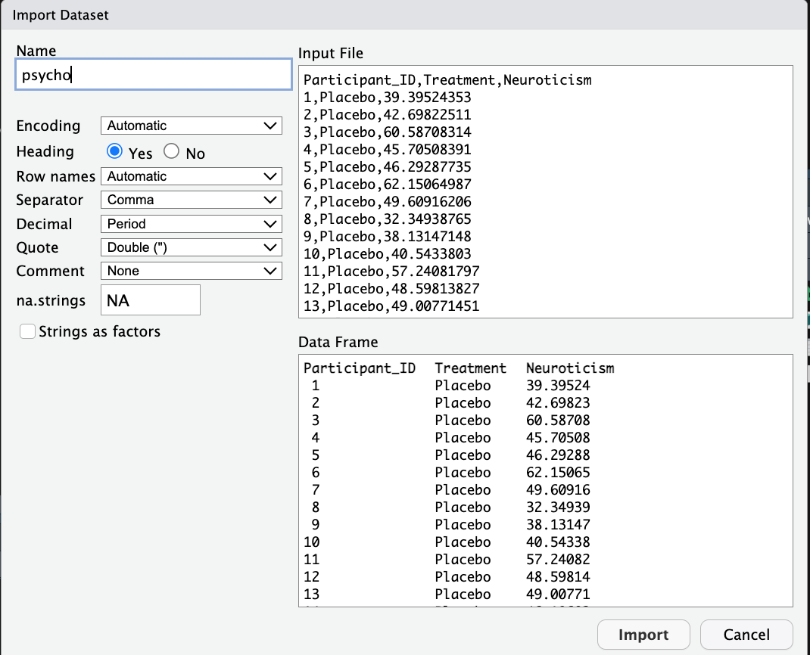

# **R Programming (Part II)** {#programming2}

Today, we are going to build upon the foundational concepts introduced last week and delve deeper into the world of R programming.

By the end of this session, you should be capable of the following:

-   Understanding the logic of functions, including how and why they are created.

-   Creating the "factor" data type and the list data structure.

-   Being capable of enhancing your RStudio experience by installing and loading packages.

-   Importing a dataset into R using both code and button-click interfaces from CSV and SPSS files.

-   Exporting data to CSV and SPSS files.

```{r echo=FALSE, warning=FALSE}

library(webexercises)

```

## Functions

In the previous two sessions, we have used several functions including: **`print()`**, **`head()`**, **`View()`**, **`mean()`**, **`sd()`**, **`summary()`**, **`aggregate()`**, **`plot()`**, **`pdf()`**, **`t.test()`**, **`class()`**, and **`c()`**. Each of these functions has served a particular purpose. All of them have taken in an input object (e.g., a variable, data type, and/or data structure), performed some operation on it, and produced some output.

But we haven't really talked about what functions actually are. I have told you they are similar to verbs in that they are "words" that do things. This makes them sound like some magical words.

You might assume that being good at programming is about learning as many functions as you can, and learning in detail what they can do, so that whenever you face a challenging situation in R, you know what tool to use.

There is some truth to this. You will inevitably learn more functions as you get better and more comfortable with R. This will make you more adept at using them. But what actually predicts becoming good at programming is your ability to understand the logic of functions and how they are created. If you grasp that, you'll be able to learn them quicker, use them more effectively, and even create your own functions.

This final point is critical. You can create your own functions. Let's create our own function to demonstrate what functions actually are.

### The Syntax for Creating a Function

Functions are somewhat similar to variables. We create variable names as labels for information. That way when we want to access that information or perform operations on it we can use the variable name rather than recreating the information in R again.

Similarly, functions are like labels for code. We come up with a name for a function (e.g., **`mean()`**) and we assign code instructions to that function. So when we call a function, we can give it information (e.g., variables), and it will take information and run that code on it. This way we don't have to write out code instructions over and over again - we can just call the function. This increases the scalability of our code.

The syntax for creating a function looks like this:

```{r eval = FALSE}

my_function <- function(argument) {
  instruction_1
  instructions_2
  ....
  instruction_n
  return(output)
}

```

What's going on here?

1.  First, we created a name, **`my_function`**, and used the assignment operator **`<-`** to tell R we are going to be storing some piece of information to that name.

2.  Then, we wrote **`function()`** to tell R that we are going to be creating a function and storing it to our name **`my_function`**. Inside **`function()`**, we specified an **`argument`**, which is just a fancy word for **`input`**.

3.  Inside the curly brackets **`{}`**, we write the code for **`my_function`**. This code comprises instructions (i.e., operations) that R will execute on our argument (i.e., input). We could have 1 instruction here, or we could have several hundred lines of instructions. That depends on the complexity of the function we are creating.

4.  We want the function to provide us with some output information. To ensure that it does that, we tell R to **`return()`** the information (**`output`**) that we want.

### Creating a Simple Function (1-Argument)

It may come as a shock to you to learn that I am not much of a chef. One of the reasons I'm not a chef is my irritation with reading recipes that include instructions like "1 cup," "10 ounces," or "17 eagle feet," or require preheating the oven to "1000 degrees Fahrenheit." What I could really use is a function that would help me convert those values automatically. Let's take the cup example. Let's create a function that will take in the number of cups we need and convert that to grams.

To do this, let's create a function called **`cups_to_grams`** (note: the naming conventions for functions are similar to the naming conventions for variables. The main rule is that your function name should describe the action it is carrying out.)

```{r eval = FALSE}

cups_to_grams <- function(cups) {
  
}

```

Inside the **`function()`**, I have given it the argument **`cups`**. In this scenario, **`cups`** acts as a placeholder variable. Inside the function, we are going to write instructions on what to do with that variable. But we have not yet defined what that variable is yet. We do that when we use the function. So don't worry about that for now.

Now inside our function (i.e., inside the **`{}`**), we need to write instructions to enable R to convert cups to grams. When I googled this, several different answers popped up. But I am just going to follow the first website I found which said: "According to the metric system, there are 250 grams in 1 cup."

Let's write that instruction inside our function. We are going to save the result of that calculation to a variable called **`grams`**.

```{r eval = FALSE}

cups_to_grams <- function(cups) {
  grams <- cups * 250
}

```

Now we are nearly done. But if we want R to provide us with the result of this function, we need to ask it to **`return()`** it to us. We can do that easily by:

```{r}

cups_to_grams <- function(cups) {
  grams <- cups * 250
  return(grams)
}


```

There we have it, we have created our first function! Now let's see if it works. In programming lingo, we say that we **`call`** a function when we use it. To call **`cups_to_grams`** it is the same process as the other functions we have used, we type out the name and then we insert our input inside the parentheses.

```{r}

cups_to_grams(cups = 1)

```

It works! We can see here what I mean that **`cups`** is a placeholder variable. We want our function to be generalizable, so we don't tell it ahead of time what **`cups`** equals. All it knows is that it will receive some information that will equate to cups, and then it will multiply that information by 250.

This enables us to call our function several times with several different values.

```{r}

cups_to_grams(cups = 4)
cups_to_grams(cups = 2)
cups_to_grams(cups = 1.5)
cups_to_grams(cups = 5L)

```

We can also define what `cups` is outside of the function.

```{r}

cups = 2
cups_to_grams(cups)

```

This is an example of a 1-argument function, as it only takes in 1 input. But we can also create functions that have multiple arguments.

### Creating a Multi-Argument Function

You might have noticed previously that sometimes we put additional information inside functions, like **`paired = TRUE`** in **`t.test()`**, or **`descending = FALSE`** in **`sort()`**. This additional information represents other arguments that we can insert inside a function.

The process for creating a multi-argument function is the same as for a single-argument function. Let's create a function called **`calculate_z_score`** that calculates the z-score of a value.

```{r}

calculate_z_score <- function(x, mean_val, sd_val) {
  # Calculate the z-score
  z_score <- (x - mean_val) / sd_val
  
  # Return the z-score
  return(z_score)
}

```

In this function:

-   **`x`** is the value for which we want to calculate the z-score.

-   **`mean_val`** is the mean score of the variable within our dataset.

-   **`sd_val`** is the standard deviation of the variable within our dataset.

Inside the function, we calculate the z-score using the formula **`(x - mean_val) / sd_val`**. The calculated z-score is returned as the output of the function.

Just like before, none of the placeholder arguments (**`x`**, **`mean_val`**, and **`sd_val`**) are defined beforehand. We will define them in our script or when we call our function.

To test this function, let's use an example of an IQ score since we know the population mean (100) and standard deviation (15). Let's see what the z-score is for someone with an IQ of 130.

```{r}

calculate_z_score(x = 130, mean_val = 100, sd_val = 15)

```

Just as we would expect, a person with an IQ of 130 is 2 standard deviations away from the mean. This shows that our function is working as expected.

What if we had a vector of IQ scores? Could we use our function to calculate the z-score of each element in our vector? Absolutely!

```{r}


calculate_z_score(x = c(100, 130, 85), mean_val = 100, sd_val = 15)

```

Sticking with this example, let's say we had a data frame with participant IDs, their age, and their IQ scores. We could feed the vector **`iq_scores`** into our **`calculate_z_score`** function, calculate their z-scores, and create a column based on those scores.

```{r}

#first let's make that data frame

iq_df <- data.frame(
  ID = c(1, 2, 3, 4, 5, 6, 7, 8),
  age = c(22, 30, 41, 45, 18, 21, 23, 45),
  iq = c(100, 123, 111, 130, 90, 102, 88, 109)
)

#now let's feed that IQ vector into our function and save it to a variable

iq_z_scores <-  calculate_z_score(x = iq_df$iq, mean_val = 100, sd_val = 15) #this will create a vector called iq_z_scores that is the output of our calculate_z_score


#if we want to add that column, we use the syntax 

#dataframe$newColumnName <- #new_vector

iq_df$iq_z_scores <- iq_z_scores


#now let's check our data frame

head(iq_df)


```

While **`calculate_z_score`** is pretty handy, it's not perfect. It requires us to calculate the mean and standard deviation functions separately and then feed that into our function. That's okay if we are dealing with variables that have a known mean and standard deviation. Outside of those examples, we would need to do some extra work. But one of the virtues about functions is that it enables us to be lazy - we want to write functions that will automate boring tasks for us. So how could we improve this function? Well luckily, we can include functions inside functions.

### Functions inside Functions

Let's say that we add a column in our **`iq_df`** dataframe that contains participants' mean scores on Beck's Depression Inventory. We'll call this column **`total_depression_beck`**.

```{r}

iq_df$total_depression_beck <- c(32, 36, 34, 46, 
                                30, 53, 40, 15) #adds the mean_depression beck vector to our dataframe

head(iq_df) #check to see if it was added correctly.

```

Since we do not know the mean and standard deviation of the Beck Inventory, we will need to calculate them using the **`mean()`** and **`sd()`** functions. Luckily, we can use those functions within **`calculate_z_score`** to enable this for us. Let's add this to our function and call it.

```{r error = TRUE}

calculate_z_score <- function(x) {
  # Calculate the z-score
  z_score <- (x - mean_val) / sd_val
  mean_val <- mean(x)
  sd_val <- sd(x)
  
  # Return the z-score
  return(z_score)
}

calculate_z_score(x = c(100, 90, 110))

```

Uh-oh! Why is it telling us that the object **`mean_val`** was not found? The reason for this is that the order of your code within a function matters. The order of your code is the order in which R will compute that instruction. Currently, I have asked R to compute **`z_score`** before defining what **`mean_val`** or **`sd_val`** are.

So when R sees **`mean_val`**, it looks everywhere for what that value could mean, doesn't find anything, and then panics and stops working. Again, humans have a theory of mind, so we would assume that we could provide this information. But R needs to do everything literally step-by-step.

To rectify this, we just need to fix the order of our instructions inside R.

```{r}


calculate_z_score <- function(x, mean_val, sd_val) {
  #compute mean_val, and sd_val first
  mean_val <- mean(x)
  sd_val <- sd(x)
  
  z_score <- (x - mean_val) / sd_val
  
  # Return the z-score
  return(z_score)
}

calculate_z_score(x = iq_df$total_depression_beck)


```

Wahey, it worked! Try to add the z-scores for the **`total_depression_beck`** to the dataframe yourself (look at the end of the previous subsection for advice on how if you are stuck).

### Returning Multiple Objects from a Function

What if we wanted to return not only the `z_score` variable from calculate_z_score, but also `mean_val` and `sd_val` as well?

Luckily, we can also tell our functions to return multiple different objects at the same time. We can do this by using lists.

We will discuss lists in more detail later in this chapter. For now, all you need to know is that lists are versatile data structures in R that can hold elements of different types. We can create a list within a function, populate it with the values we want to return, and then return the list itself.

We can create a variable within our function that is a list containing all the information we want to return. But since this changes the nature of the function, we are going to change its name to: \`calculate_mean_sd_z\`

```{r}

calculate_mean_sd_z <- function(x, mean_val, sd_val) {
  #compute mean_val, and sd_val first
  mean_val <- mean(x)
  sd_val <- sd(x)
  
  z_score <- (x - mean_val) / sd_val
  
  results <- list(z_score, mean_val, sd_val)
  
  # Return the z-score
  return(results)
}

calculate_mean_sd_z(iq_df$total_depression_beck)
```

This produces the results that we want, but the output leaves a lot to be desired. If someone else was calling our function, but was not aware of the instructions inside it, they might not know what each value from the output corresponds to. We can correct this by using the following syntax inside the list to label each value: `name_of_value = value`

```{r}

calculate_mean_sd_z <- function(x, mean_val, sd_val) {
  #compute mean_val, and sd_val first
  mean_val <- mean(x)
  sd_val <- sd(x)
  
  z_score <- (x - mean_val) / sd_val
  
  results <- list(z = z_score, mean = mean_val, sd = sd_val)
  
  # Return the z-score
  return(results)
}

calculate_mean_sd_z(iq_df$total_depression_beck)

```

Now if we wanted to extract certain features from the function, we can use the \`\$\` operator.

```{r}


scores <-  calculate_mean_sd_z(iq_df$total_depression_beck)

scores$mean

scores$sd

scores$z
```

### Some Important Features about Functions

There are some important features about functions that you should know. Namely, the difference between Global and Local Variables and the ability to set and override Default Arguments.

#### Global vs Local Variables

It is important to note that R treats variables you define in a function differently than variables you define outside of a function. Any variable you define within a function will only exist within the scope of that function. Variables defined in a function are called local variables whereas variables defined outside of a function are called global variables.

```{r error = TRUE}

num1 <- 20 #this is a global variable

local_global <- function() {
  num1 <- 10#this is a local variable
  print(num1)  # This will print 10
}

local_global()

print(num1)  # Error: object 'local_var' not found

```

We start this code chunk by assigning the value 20 to the variable `num1`. This is a global variable, it will exist across our R environment unless we change it to a different value.

Within the `local_global()` function, we create another variable called `num1` and assign it the value of 10. But this is an example of a local variable, as it only exists inside of our function. When we run our function, it will print out 10, but the function will not change the global value of the variable.

#### Default Arguments

In R, functions can have default arguments, which are pre-defined values assigned to arguments in the function definition. Default arguments allow functions to be called with fewer arguments than specified in the function definition, as the default values are used when the arguments are not explicitly provided.

#### Syntax for Default Arguments

The syntax for defining default arguments in R functions is straightforward. When defining the function, you can assign default values to specific arguments using the **`argument = default_value`** format.

Imagine I wanted to write a function that greeted someone. I could write the following function, **`greet`**:

```{r}

# Function with default argument
greet <- function(name = "World") {
  print(paste("Hello,", name))
}

```

Within this function, I set the default value for the argument name as "World". So if I were to call the function but not specify the argument, the following would happen:

```{r}

# Calling the function without providing arguments
greet() 

```

However, we can also override the default value of a function.

```{r}

greet(name = "Ryan") #please feel free to type in your own name

```

Having default values in a function enables them to be called with fewer arguments, making code more readable. But since default values can be overridden, it also provides them with a degree of combustibility.

### Exercises

1.  Create a function named **`fahrenheit_to_celsius`** that converts a temperature from Fahrenheit to Celsius.

    Instructions:

    1.  Define the function **`fahrenheit_to_celsius`** with an argument named **`fahrenheit`**.

    2.  Inside the function, create a variable named **`celsius`** to store the converted temperature.

    3.  Calculate the Celsius temperature using the formula: **`(fahrenheit - 32) / 1.8`**.

    4.  Return the **`celsius`** variable.

2.  Create a function called **`calculate_discount`** that calculates the discounted price of an item.

    1.  Define the function **`calculate_discount`** with two arguments: **`price`** and **`discount_percent`**.

    2.  Inside the function, create a variable named **`discount_price`** to store the discounted price.

    3.  Calculate the discounted price using the formula: **`price * (1 - discount_percent)`**.

    4.  Return the **`discount_price`**.

3.  Add the z-scores for the Beck scale back into the iq_df data frame.

    Instructions:

    1.  Use the **`calculate_z_score`** function you created earlier to calculate the z-scores for the Beck scale.

    2.  Add the calculated z-scores to the **`iq_df`** data frame as a new column.

4.  Look up help on the head() function - what is the default value for the number (n) of rows it prints argument?

    Instructions:

    1.  Use the **`?head`** command to access the documentation for the **`head()`** function.

    2.  Identify the default value for the **`n`** argument in the documentation.
    
    3. Call the head() function on the sleep dataframe, but override the default argument with a different number

## The Factor Data Type

In Chapter 3, we introduced the four fundamental data types in R: character, integer, numeric, and logical. We learned that these data types can constitute vectors, which can then be aggregated in data frames. These data types cover a significant proportion of the information we encounter in psychological research. In terms of NOIR data types in Psychology, nominal data can be represented through the character type, ordinal data can be represented through character or integer/numeric data types, and scale data (interval and ratio) can be represented through the integer/numeric data type. Additionally, the logical data type can handle either/or cases.

However, there's an additional consideration. When dealing with datasets common in psychological research, particularly experimental or differential research, we often encounter columns consisting of categorical data representing our independent variable(s). The responses in these columns signify differences in categories for each participant (e.g., whether they were assigned to the control or experimental group, whether they belong to different categories across some domain). In software like SPSS, we typically label this categorical data using normal language (e.g., "control" or "experimental") or numerically (1 = "control", 2 = "experimental"). While we could categorize it as character data or numerically/integer data in R, this approach doesn't capture the fact that the data in this column represents something distinct - namely, that it is a ***factor*** used to understand differences across other variables.

Fortunately, R offers a data type called ***factors*** to address this need.

### Creating a Factor

Let's say we run an experimental study investigating the effect of caffeine on sleep duration. Participants are randomly assigned to three experimental conditions: **`No Caffeine`**, **`Low Caffeine (200 mg)`**, and **`High Caffeine (400 mg)`**. Our data frame might resemble the following, where **`1`** = **`No Caffeine`**, **`2 = Low Caffeine`**, and **`3 = High Caffeine`**:

```{r}

caffeine_df <- data.frame(
  id = c(1:12),
  sleep_duration = c(7.89, 8.37, 7.46, 5.86, 5.25, 7.23, 6.05, 5.78, 6.77, 2.13, 5.78,  6.54),
  group = c(1, 2, 3, 1, 2, 3, 1, 2, 3, 1, 2, 3)
)

head(caffeine_df)

```

Although the **`group`** column is currently stored as numeric data, it actually represents categorical information. It wouldn't make sense to compute the mean, median, or standard deviation for this column. However, since it's numeric data, R allows us to do so.

```{r}

mean(caffeine_df$group)

```

While this might not cause immediate problems, it could lead to issues later when conducting inferential statistical tests like ANOVAs or regressions, where R expects a factor data type.

To address this, we can use the **`factor`** function to convert the group column:

```{r}

factor(caffeine_df$group)

```

Now, R recognizes that each distinct value in the column represents a different level of our independent variable. If we attempt to calculate the mean now, it will result in an erro:

```{r}

mean(caffeine_df$group)

```

Whoops! What's wrong here? Well, when we called the **`factor()`** function, we never reassigned that information back to the 'group' vector in our **`caffeine_df`** data frame. So while R ran our command, it did not save it. To fix this, we just follow the syntax for creating a new column we learned last week **`data.frame$newcolumn <- vector`**.

```{r}

caffeine_df$group <- factor(caffeine_df$group)

```

Now, attempting to compute the mean will result in an error, as expected:

```{r}

mean(caffeine_df$group)

```

But I am not completely satisfied yet. Although right now we can remember that 1 = No Caffeine, 2 = Low Caffeine, and 3 = High Caffeine, we might forget that information in six months' time if we return to our dataset.

Luckily, we can label the levels of our factor through the **`levels()`** function.

```{r}


levels(caffeine_df$group) <- c("No Caffeine", "Low Caffeine", "High Caffeine")

print(caffeine_df$group)

```

That's better!

### Using Factors to Sort Character Data

Factors also enable us to sort character data in an ordered manner that isn't alphabetical. For example, consider a vector called **`degree`** that denotes participants' highest level of education completed:

```{r}

degree <- c("PhD", "Secondary School", "Masters", "Bachelors", "Bachelors", "Masters", "Bachelors", "Secondary School", "Secondary School", "Secondary School")

```

Using the **`table()`** function, we can count the number of participants per category:

```{r}

count <- table(degree)
count

```

And we can use the `barplot()` function to visualize those counts.

```{r}
barplot(count)
```

Now that gives us the information we need, but it's not ordered in an intuitive manner. Ideally, we would want the order of the bar plots to match the hierarchical order of the data, so that it would be: "Secondary School", "Bachelors", "Masters", and then "PhD". However, unless you specify the order of your levels, R will specify their order alphabetically.

There is an argument called `levels` in the `factor` function that we can use to rectify this. In the levels argument, we specify the order of the levels.

```{r}

degree_ordered <- factor(degree, levels = c("Secondary School", "Bachelors", "Masters", "PhD"))
degree_ordered

```

That's more like it. Now we can call the `table()` and `barplot()` functions again to visualise the number of participants per group.

```{r}

count_ordered <- table(degree_ordered)

barplot(count_ordered)

```

As you can see, our data looks much cleaner and more intuitive.

There is a lot more we can do with factors, but this covers the main points. Now let's talk about the last data type/structure we are going to be using in this course, which is the `list` data structure.

### Exercises

**Exercise 1 - Convert Numeric Data to Factor:**

-   Create a vector called **`personality`** containing personality types: "Introverted", "Extroverted", "Introverted", "Introverted", "Extroverted", "Extroverted".

-   Convert the **`personality`** vector to a factor and store it in a new variable called **`personality_factor`**.

-   Display the levels of the **`personality_factor`** variable.

**Exercise 2 - Count and Visualize Factor Levels:**

-   Using the created **`personality`** vector from Exercise 1, create a table to count the number of occurrences of each Personality trait.

-   Visualize the counts using a bar plot to show the distribution of genders.

**Exercise 3 - Modify Factor Levels:**

```{r}

# Treatment conditions vector
treatment <- c("Control", "Placebo", "Therapy", "Medication", "Therapy", "Placebo", "Control", "Medication")

```

-   Reorder the levels of the **`treatment`** vector so that "Therapy" becomes the first level, followed by "Control", "Placebo", and "Medication".

-   Print the modified levels of the **`treatment`** variable to verify the order.

**Exercise 4 - Factor Conversion with Levels:**

-   Create a vector called **`coping_strategy`** with the following values: "Problem-focused", "Emotion-focused", "Avoidant", "Problem-focused", "Emotion-focused", "Avoidant", "Problem-focused".

-   Convert the **`coping_strategy`** vector to a factor with levels specified as "Problem-focused", "Emotion-focused", "Avoidant", and store it in a new variable called **`coping_strategy_factor`**.

-   Display the levels of the **`coping_strategy_factor`** variable.

## The List Data Structure

The two data structures we have discussed so far, vectors and data frames, are excellent ways to store data. However, each data structure has its limitations. Both vectors and data frames only allow us to store one object of data at a time.

What do I mean by one object of data? Well, when we create a vector, we are only storing information for one single vector in R. While we can store multiple vectors in one place in R by combining them into a data frame, this is only possible if each vector has the same number of data points. Based on what I have taught you so far, there is no way to store two independent and separate vectors in the same place in R.

Similarly, when I create a data frame, I am only storing information for one data frame. But sometimes we would want to keep multiple data frames saved in a similar location, similar to an Excel file that has multiple worksheets saved onto it.

Finally, what if I wanted to store a vector and a data frame together? For example, imagine I had a data frame that was a cleaned data set, and I wanted to store a vector with results from the analysis. Based on what I have taught you so far, there is no way to store both a vector and a separate data frame in a single space in R.

That's where the list data structure comes into play.

### Understanding Lists

A list in R is a versatile data structure that can hold elements of different types, such as vectors, matrices, data frames, or even other lists. Think of it as a container that can store various objects together, similar to a bag where you can put in items of different shapes and sizes.

### Creating Lists

Suppose we're conducting a study where we collect various information about each participant, such as their demographic details, test scores, and responses to questionnaires. We can store this information for each participant in a list. Here's how we can create a list for three participants:

```{r}

participant1 <- list(
  ID = 1,
  age = 25,
  gender = "Male",
  test_scores = c(80, 75, 90),
  questionnaire_responses = c("Agree", "Disagree", "Neutral", "Agree")
)

participant2 <- list(
  ID = 2,
  age = 30,
  gender = "Female",
  test_scores = c(85, 70, 88),
  questionnaire_responses = c("Neutral", "Agree", "Disagree", "Strongly Disagree")
)

participant3 <- list(
  ID = 3,
  age = 28,
  gender = "Non-binary",
  test_scores = c(78, 82, 85),
  questionnaire_responses = c("Disagree", "Neutral", "Agree", "Neutral")
)


```

The list for each participant is made up of separate vectors with varying lengths (e.g., there is only 1 element in ID, age, and gender, whereas there are 3 elements in test_scores and 4 in questionnaire_responses).

Let's print out the **`participant1`** list and break down the output:

```{r}

print(participant1)

```

When we print out the list, what R does in the console is print out the name of each object and then print out each element in that object. One thing that you might notice is the return of the `$` which we use to access elements from vectors or columns from data frames. Luckily, we can also use the `$` symbol to access objects and their elements from a list. So I wanted to extract `test_scores` from a list, I could type the following code:

```{r}

participant1$test_scores

```

I could also do this numerically using the [] notation we used when accessing vectors.

```{r}

participant1[4]

```

Because `test_scores` is the fourth object within the list (the first three are ID, age, and gender), `test_scores[4]` is needed to extract it.

Regardless of which way you extract data, doesn't the output should look familiar? It is essential the same output when we print out a vector. That's not accidental, because we have in fact extracted a vector!

So what could we do if wanted to access the 1st and 3rd element from this vector? We just follow the same convention that we used last week `vectorname[elementswewant]`

```{r}

participant1$test_scores[c(1, 3)]

```

This illustrates a key point about lists. Once you first access an object (e.g., vector or dataframe) within that list, then you can use the specific indexing criteria for accessing elements within that object. For example, let's look at a list with a vector and a data frame.

```{r}

df_v <- list(
  iq_df = iq_df, 
  p_values = c(.001, .10, .05)
)

print(df_v)

```

We can see that the first object in our list is the iq_df data frame, and the second contains (totally made up) p-values. So if wanted to access the `iq` and `total_depression_beck` columns from this data frame, and the first five rows, we can use the same subsetting techniques we learned last week: `dataframe[rows_we_want, columns_we_want]`

```{r}

df_v$iq_df[1:5, c("iq", "total_depression_beck")]

```

### Lists within Lists (Indexing)

What happens if we combine lists together? Well, we can do that by putting lists inside lists. However, if we do that, the output might seem a bit overwhelming at first.

```{r}

participant_data <- list(participant1, participant2, participant3)
 
print(participant_data)
```

Right now your eyes might be glazing over and that SPSS icon on your desktop has never looked so good. But just relax, while what you might be seeing here is **ugly**, I promise you it's not complicated.

Let's break down the first part of this output

```{r eval = FALSE}

[[1]]

```

This notation **`[[1]]`** extracts and indicates the first list within our combined list **`participant_data`** (in this case participant1). Similarly, **`[[2]]`** would indicate the second list (participant2), and so on. It's similar to how we index elements in vectors.

```{r eval=FALSE}

[[1]]$ID #this translates to from participant data, pick participant 1 and then extract ID

[[1]]$age #this translates to from participant data, pick participant 1 and then extract age

[[1]]$test_scores #this translates to from participant data, pick participant 1 and then extract test scores

[[1]]$questionnaire_responses #this translates to from participant data, pick participant 1 and then questionnaire_responses

```

Basically translates to "participant 1's data for ID, age, test_scores and questionnaire_responses".

There is a way we can make this code output neater. When we are creating a list, we can specify the index term for that list. The syntax for doing is: new index term = current_list

```{r}

participant_data <- list(p1 = participant1, #new index term = current list
                         p2 = participant2, #new index term = current list
                         p3 = participant3 #new index term = current list
                         )

print(participant_data)

```

### Summary

In summary, the list data structure in R is incredibly useful for organizing and managing diverse types of data in psychological research. Whether it's participant information, experimental conditions, or any other heterogeneous data, lists provide a flexible and efficient way to store and access this information.

## R Packages

Throughout this course, we've been exploring the capabilities of base R, which offers a rich set of functions and data structures for data analysis and statistical computing. However, the power of R extends far beyond its base functionality, thanks to its vibrant ecosystem of user-contributed packages.

### Understanding R Packages

R packages are collections of R functions, data, and documentation that extend the capabilities of R. These packages are developed and shared by the R community to address various needs in data analysis, visualization, machine learning, and more. By leveraging packages, R users can access a vast array of specialized tools and algorithms without reinventing the wheel.

### Installing and Loading R Package

One of the most important things to know about R packages is that you first need to install them on your computer. Once installed, you will not need to install them again.

However, if you want to use a package, then you will need to load it while you are in RStudio. Every time you open RStudio after closing it, you will need to load that package again if you want to use it.

In this way, R packages are like applications on your phone. Once you download Spotify on your phone, then you won't need to install it again. But every time you want to use Spotify, you will need to open the application.

#### Installation

We are going to install three packages called Haven, praise, and fortunes. The praise package provides users with, well, praise. And the fortunes package will spit out statistic and programming quotes at you. Neither of them is particularly useful, other than demonstrating the process of loading packages.

The Haven package enables you to load SPSS data into R.

#### Installation using RStudio Interface

In the Files pane on the bottom right-hand corner of R, you will see a tab called "Packages". Click that tab. You will already see a list of packages that are currently installed. You will see three columns:

-   Name (the name of the R package)

-   Description (describes what the package does)

-   Version (the version of the package currently installed on your computer)

To install a package, click the "Install" button above the "Name" column. Once you click that, you should see a small pop-up window. In the textbox, type in the word Haven. Make sure the box "Install dependencies" is clicked. After that, you can click Install. You should get something like the following output in the console, which looks scary with all the red text, but means it has worked correctly.

```{r eval = FALSE}
> install.packages("Haven")
trying URL 'https://cran.rstudio.com/bin/macosx/big-sur-x86_64/contrib/4.3/rio_1.0.1.tgz'
Content type 'application/x-gzip' length 591359 bytes (577 KB)
==================================================
downloaded 577 KB


The downloaded binary packages are in
	/var/folders/h8/8sb24v_x2lg51cg2z7q8fk3w0000gp/T//RtmpvaY1Ue/downloaded_packages
```

#### Installation using Commands

If we want to install packages using the console, you can use the **`install.packages()`** function followed by the name of the package you wish to install. The syntax would looks like this

```{r eval = FALSE}

install.packages("package name")

```

The important thing here is that whatever goes inside the parentheses is inside quotation marks. Let's use this syntax to install the `praise` and `fortunes` packages.

```{r eval = FALSE}

install.packages(c("praise", "fortunes"))


trying URL 'https://cran.rstudio.com/bin/macosx/big-sur-x86_64/contrib/4.3/praise_1.0.0.tgz'
Content type 'application/x-gzip' length 16537 bytes (16 KB)
==================================================
downloaded 16 KB

trying URL 'https://cran.rstudio.com/bin/macosx/big-sur-x86_64/contrib/4.3/fortunes_1.5-4.tgz'
Content type 'application/x-gzip' length 208808 bytes (203 KB)
==================================================
downloaded 203 KB


The downloaded binary packages are in
	/var/folders/h8/8sb24v_x2lg51cg2z7q8fk3w0000gp/T//RtmpvaY1Ue/downloaded_packages

```

Again the output is rather scary but the sentences "package 'praise' successfully unpacked and MD5 sums checked" and "package 'fortunes' successfully unpacked and MD5 sums checked" mean that they are successfully installed onto your computer.

### Loading Packages

Okay, now to actually use those packages, we will need to load them. Again, I will show you two ways to load packages.

#### Loading using RStudio Interface

Go back to the Packages tab in the File pane. On the left-hand side of the package name, you will see a tick box. If the box is ticked, that means the package is currently loaded. If it is unticked, it is not loaded.

Scroll down to find the package "praise" and load it by ticking the box.

```{r fig.cap = "Loading Packages through RStudio Interface", echo = FALSE}

library(knitr)

include_graphics("img/04-praise-loaded.png")

```

You should see something like the following in your R console (don't worry if you get a warning message like mine, or if you don't receive a warning message)

```{r eval = FALSE}

> library(praise)
Warning message:
package ‘praise’ was built under R version 4.3.2 

```

#### Loading using the R Console Command

We can use the same syntax from that R console output to load in packages there. To load in the `fortunes` and `Haven` packages, you can type in the following into the console or script one at a time:

```{r}

library(fortunes)
library(haven)

```

There is one significant difference between installing and loading packages through code. When you are installing packages, you can install multiple packages in one command. However, you can only load one package at a time

```{r eval = FALSE}

#will work
install.packages(c("package1", "package2", "package3")) 


#will not work
library(c("package1", "package2", "package3")) 

#the following will work
library(package1)
library(package2)
library(package3)

```

### Testing our New Functions

To make sure the following functions are working, run the following code to check:

```{r echo = FALSE}

library(praise)

praise() #everytime you run this line of code it gives you a different line of praise
#so don't be worried if your result is different than mine

fortune() #this will print out something so incredibly nerdy 

```

```{r eval = FALSE}

praise() #everytime you run this line of code it gives you a different line of praise
#so don't be worried if your result is different than mine

fortune() #this will print out something so incredibly nerdy 

```

### Error Loading Packages

If you ever encounter the following error when trying to load a package:

```{r error = TRUE, warning=TRUE}

library(madeuppackage)

```

This means that you have either made a typo in writing the name of the package or you have not installed the package. You need to install packages before R will be able to load them.

### Package Conventions if Using Code

There are important rules to follow when writing code to install and load packages in R.

Firstly, any packages you install and load onto R should be placed at the top of the R script you are working on. This way, anyone following your analysis can easily spot the packages they will need.

Secondly, you should type the command **`install.packages("package_name")`** in the console rather than the script. If someone downloads your script and accidentally runs it, it will automatically install the packages on their computer. We want to avoid this as it might interfere with other aspects of their operating system (this is rare, but it's better to be cautious).

Thirdly, if you do include the command **`install.packages()`** in the script, make sure it is commented out. This way, if it is accidentally run, R won't execute that command.

```{r fig.cap = "Conventions for Installing and Loading Packages in R Script", echo = FALSE}

include_graphics("img/04-packages-convention.png")

```

### Summary

There you have it. You have successfully installed and loaded your first packages in R. Are they particularly useful packages? No! In the rest of this course, we will be loading packages more regularly, and these packages will make our lives significantly easier than if they were not around. In fact, we will use the `haven` package in the next section that will enable us to import SPSS data.

## Importing and Exporting Data {#importing}

While creating data frames and lists in R is valuable, the majority of the data you'll work with in R will likely come from external sources. Therefore, it's essential to know how to import data into R. Similarly, once you've processed and analyzed your data in R, you'll often need to export it for further use or sharing.

In this section, we'll explore how to import and export data using the graphical user interface (GUI) provided by RStudio. The GUI offers a user-friendly and intuitive way to manage data files without requiring you to write any code. Let's delve into the process of importing and exporting data using the RStudio GUI.

First, you'll need to download two files: `psycho.csv` and `burnout.sav`. Both files are available in the rintro Teams channel. If you don't have access to the Teams channel, please contact me at ryan.donovan\@universityofgalway.ie.

### Importing CSV files.

Comma-Separated Values (CSV) files are a prevalent format for storing tabular data. Similar to Excel files, data in CSV files is organized into rows and columns, with each row representing a single record and each column representing a different attribute or variable.

CSV files are plain text files, making them easy to create, edit, and view using a simple text editor. This simplicity and universality make CSV files a popular choice for data exchange across various applications and platforms.

In a CSV file, each value in the table is separated by a comma (,), hence the name "comma-separated values." However, depending on locale settings, other delimiters such as semicolons (;) or tabs (\\t) may be used instead.

One of the key advantages of CSV files is their compatibility with a wide range of software and programming languages, including R. They can be effortlessly imported into statistical software for analysis, making them a versatile and widely adopted format for data storage and sharing.

To import the "psycho.csv" file, please follow these steps:

1.  Open RStudio.

2.  Navigate to the Environment pane (top right hand corner) and make sure the Environment tab is clicked.

3.  Click on the "Import Dataset" button.

4.  Select "From Text (base)".

5.  Browse your folder and select the "psycho.csv" to import.

6.  Click "Open".

7.  A pop-up window should now open. There is a lot of different information here, so let's unpack it.

    -   The "Name" text box enables you to specify the variable name assigned to the data frame. Leave it as "psycho."

    -   Most of the time, you can leave the options with the default settings.

    -   The "Input File" box shows a preview of the CSV file being imported.

    -   The "Data Frame" box displays a preview of how the data frame will look once the CSV is imported into R.

```{r fig.cap="Pop-up window for importing CSV files"}

library(knitr)



```

8.  Click Import. A tab in the source pane called "psycho" should now open showing the data frame. Additionally, you should also see the data frame in the Environment pane. You should see under value that it has "60 obs. of 3 variables" which means there are 60 rows of data and 3 columns of data.
9.  Once you have imported your data in R, it is always good practice to briefly check that it has been imported successfully and you have imported the correct data set. Two ways you can do this is by calling the `head()` and `summary()` functions on the data frame.

```{r echo = FALSE}

psycho <- read.csv("datasets/psycho.csv")
Burnout <- read_sav("datasets/Burnout.sav")

```

```{r}

head(psycho) #this will print out the first six rows

summary(psycho) #print out summary stats for each column

```

If your results match mine, it means you have correctly imported the data.

### Importing SPSS (.sav files).

SPSS (Statistical Package for the Social Sciences) is another popular software used for statistical analysis, particularly in the social sciences. SPSS data files are typically saved with a **`.sav`** extension. These files can contain data, variable names, variable labels, and other metadata.

To import an SPSS file (**`burnout.sav`**), follow these steps:

1.  Open RStudio.

2.  Navigate to the Environment pane (top right-hand corner) and make sure the Environment tab is clicked.

3.  Click on the "Import Dataset" button.

4.  Select "From SPSS".

5.  A pop-up window will open.

```{r}

include_graphics("img/04-import-sav.png")

```

6.  Browse your folder and select the **`burnout.sav`** file to import.

7.  Under Import Options, you can set the name of the data frame variable in R for the SPSS data set. Leave it as `burnout.sav`.

8.  The Code Preview shows you the written code commands that you could type out to import the data frame instead of using the RStudio interface.

9.  To import the dataframe, click "Import".

After importing, a tab in the source pane called "burnout" should open, displaying the data frame. Additionally, you should see the data frame in the Environment pane. Under the "value" column, it should indicate "467 obs. of 6 variables," indicating there are 467 rows and 6 columns of data.

Once imported, use the **`head()`** and **`summary()`** functions to check that the data has been imported correctly:

```{r}

head(Burnout)

summary(Burnout)

```

If your results match mine, then you have successfully imported the SPSS data into R.

### Exporting Datasets in R

After analyzing and processing your data in R, you may need to export the results to share them with others or use them in other applications. R provides several functions for exporting data to various file formats, including CSV, Excel, and R data files. In this section, we'll explore how to export datasets using these functions.

#### Exporting to CSV Files

To export a dataset to a CSV file, you can use the write.csv() function:

```{r eval = FALSE}

# Export dataset to a CSV file using the following syntax
write.csv(my_dataset, file = "output.csv")

```

The argument `file` will create the name of the file and enable you to change the location of the file. The way this is currently written, it will save your file to your working directory. If you need a reminder on how to set and check your working directory [click here](#set_wd). Make sure it is set to the location you want your file to go.

Let's write the `iq_df` as a CSV file.

```{r}

write.csv(iq_df, file = "iq_df.csv")

```

In your working directory (check the Files pane), you should see the file `iq_df.csv`. If you go to your file manager system on your computer, find the file, and open it, the file should open in either a text or Excel file.

#### Exporting to SPSS Files

To export a dataset to an SPSS file, you can use the **`write.foreign()`** function from the **`foreign`** package. First, make sure you have installed and loaded the **`foreign`** package:

```{r}
#install.packages("foreign")
library(foreign)
```

Then, use the following syntax to export data frames to SPSS:

```{r eval = FALSE}
write.foreign(my_dataset, #the dataset you are exporting
              datafile = "output.sav", #the location you will export your data
              codefile = "output.sps", #this creates the syntax for converting your file to SPSS
              package = "SPSS") #this specifies the package the exported file will work for

```

You might be wondering why there is both a datafile and a codefile argument. Let's break each down:

-   datafile: This argument specifies the file path where the data will be saved in the desired format (e.g., SPSS data file). The datafile argument is used to store the actual data values from the R dataset.

-   codefile: This is where the instructions on how to use your data are saved. When you specify a file path for the codefile argument, R will create a file containing commands or instructions that another program (like SPSS) can use to understand and import your data correctly. It's like writing down step-by-step directions for SPSS to follow.

So, in simple terms, the datafile is where your data is saved, while the codefile contains the instructions for using that data in another program. They work together to make sure your data can be easily used in different software programs.

Now let's export the `psycho` data frame (we imported from CSV) to SPSS!

```{r}

write.foreign(psycho, #the dataset you are exporting
              datafile = "psycho.sav", #the location you will export your data
              codefile = "psycho.sps", #this creates the syntax for converting your file to SPSS
              package = "SPSS") #this specifies the package the exported file will work for

```

Again this will save the file in your working directory. If you go to your file explorer system and open up the file, it should open SPSS for you.

## Summary

Congratulations, you've made it through Programming Part I and II! We've covered a lot of useful (but let's be honest, not exactly riveting) concepts in programming with R. Throughout these sections, we've learned how R categorizes data, stores it in data structures, converts data types, and creates variables and functions. Additionally, we've explored how to install and load packages to enhance R's capabilities, and how to import and export data.

With this foundation, we're now well-equipped to move on to the next phase: data processing. In the upcoming week, we'll dive into methods for cleaning our data, setting the stage for more advanced analyses.

## Glossary 

| **Term**        | **Definition**                                                                                                                  |
|-----------------|---------------------------------------------------------------------------------------------------------------------------------|
| CSV             | Comma-Separated Values: a common file format for storing tabular data, where each value is separated by a comma.                |
| SPSS            | Statistical Package for the Social Sciences: software commonly used for statistical analysis, often associated with .sav files. |
| Dataframe       | A two-dimensional data structure in R that resembles a table with rows and columns. It can store mixed data types.              |
| Importing       | The process of bringing data from external sources into R for analysis or manipulation.                                         |
| Exporting       | The process of saving data from R to external files or formats for use in other applications.                                   |
| write.csv()     | A function in R used to export a dataset to a CSV file.                                                                         |
| write.foreign() | A function in R used to export a dataset to other formats, such as SPSS files.                                                  |
