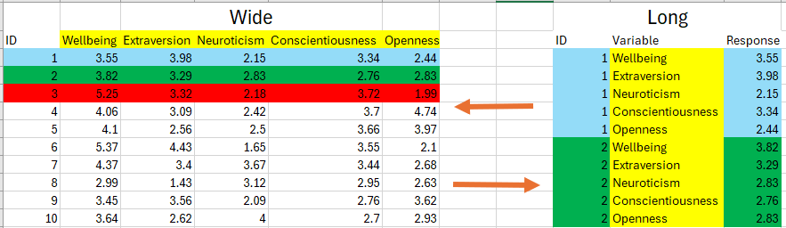
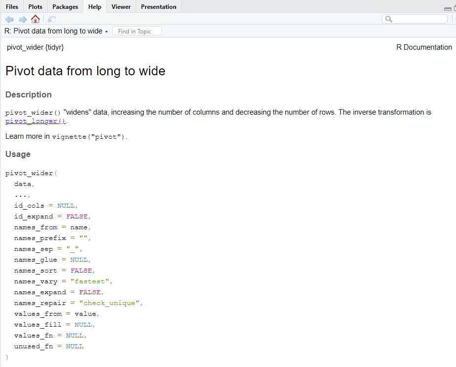

# Data Wrangling and Cleaning (Part II) {#datacleaning2}

```{r setupd, include=FALSE}


library(tidyverse)
library(knitr)

df_clean <- read.csv("datasets/raw_remote_clean.csv")

df_clean <- df_clean %>% select(-X)

```

In this session, we are going to learn how to clean more challenging data than what we encountered in [Chapter 5](#datacleaning1). In contrast to the last chapter, this section is more of a reference guide than an end-to-end cleaning example. That's because the tools you learn here might not always pop up, or at least are unlikely to all pop up in the one data frame. Nonetheless, when you combine the functions you learn here to clean data with the functions from last week, you will be able to handle an impressive amount (probably around 80%) of any data cleaning challenges you will encounter in your research.

By the end of this session, you should be capable of the following:

-   Understand the concepts of **wide** and **long** data and be capable of **`pivoting`** (i.e., transforming) from one format to another.

-   Know how to merge together separate data frames into one file that you can clean.

-   Identifying and handling missing data (**`NA`** values).

## Let's Get Set Up

Similar to the last chapter, first we need to set up RStudio and download some data files.

### Activity 1.1: Set up your WD

Remember that the working directory is the location where we want to store any resulting data files or scripts that you'll work on in a session. In Chapter 2, I showed you how to do this using [a button-and-click interface](#set_wd).

Using those instructions, create a folder called "Week5" in the **`rintro`** project folder (or whatever folder you created) and set it as your working directory. Use the **`getwd()`** to check that it has been set as your working directory. Your output should be something like this:

```{r eval = F}

> setwd("C:/Users/0131045s/Desktop/Programming/R/Workshops/Example/Rintro_2024/week5")

```

### Activity 1.2: Import your CSV files and R script

You need to import several files for this activity:

1.  **background.csv**

2.  **flanker_task1.csv**

3.  **flanker_task2.csv**

4.  **flanker_task3.csv**

5.  **demographics.csv**

6.  **reaction_time.csv**

7.  **raw_remote_clean.csv**

To download these files, navigate to the Teams channel for this course and access the "Week 5 - Data Cleaning (Part II)" channel. Once downloaded, use your file management system (File Explorer on Windows or Finder on Mac) to copy and paste these files into the "Week5" folder you created in Activity 1.1.

f you're using RStudio, you should see these files in your working directory within the Files pane. Create an R script and save it as (**data_cleaning_ii_script.R**).

To import the raw_remote_associations.csv dataset into R, do the following:

1.  Click Environment in the Environment Pane -\> Import Dataset -\> From Text(base) -\> Select **demographics.csv -\>** change its name to **df_dem**
2.  Click Environment in the Environment Pane -\> Import Dataset -\> From Text(base) -\> Select **flanker_task1.csv -\>** change its name to **df_flanker1**
3.  Click Environment in the Environment Pane -\> Import Dataset -\> From Text(base) -\> Select **flanker_task2.csv -\>** change its name to **df_flanker2**
4.  Click Environment in the Environment Pane -\> Import Dataset -\> From Text(base) -\> Select **flanker_task3.csv -\>** change its name to **df_flanker3**
5.  Follow the same instructions to import the **demographics.csv**, **reaction_time.csv,** and **raw_remote_clean.csv** files. Change their name to **df_demographics,** **df_rt, and df_clean** respectively.
6.  [See Chapter 4's section on importing data for more information](#importing)

Alternatively, you can write and run the following commands within the **data_cleaning_ii_script.R**. Just make sure they are in the Week 5 folder and that you have set that folder as your working directory.

```{r eval = F}

df_background <- read.csv("background.csv") 

df_flanker1 <- read.csv("flanker_task1.csv")

df_flanker2 <- read.csv("flanker_task2.csv")

df_flanker3 <- read.csv("flanker_task3.csv")

df_demographics <- read.csv("demographics.csv")

df_rt <- read.csv("reaction_time.csv")

  
```

```{r echo = F}

df_demographics <- read.csv("datasets/demographics.csv")

df_rt <- read.csv("datasets/reaction_time.csv")

df_background <- read.csv("datasets/background.csv") 
  
  df_flanker1 <- read.csv("datasets/flanker_task1.csv")
  
  df_flanker2 <- read.csv("datasets/flanker_task2.csv")
  
  df_flanker3 <- read.csv("datasets/flanker_task3.csv")

```

### Activity 1.3: Load the tidyverse package

A good practice in R is to load packages at the start of your script. Write the following in your R script to load in tidyverse.

```{r eval = FALSE}

library(tidyverse)

```

Okay, now we are ready to get cleaning!

## Data Formats (Long and Wide Data) {#dataformats}

Psychological research often involves working with data stored in tables, commonly referred to as **`Data Frames`**. These tables can take two primary formats: **`wide`** or **`long`**. Depending on the research software used, the raw data downloaded from a study might be in either **`wide`** or **`long`** table format.

Understanding the differences between these formats is crucial because each format facilitates certain tasks more easily. Similarly, knowing how to effectively and efficiently **`pivot`** (i.e., transform or convert) between these formats is essential for performing specific tasks on the data. Fortunately, R and the tidyverse package are well-equipped to handle both types of data and to convert between them seamlessly.

In this section, we will first define **`wide`** and **`long`** data formats and discuss the advantages of each format over its counterpart. We will then explore how to pivot between these formats using R.

### Defining Long and Wide Data

**Wide Data**

In wide data, each row represents a unique participant, and each column represents a separate variable. Table 6.1 shows an example of data in wide format. Each row contains all the information on a specific participant across each variable collected. For example, in one row of information, we can observe that participant 2 is 25 years old, 165 centimeters tall, weighs 60kg, and has a BMI score of 22.

| ID | Age | Height | Weight | BMI |
|:--:|:---:|:------:|:------:|:---:|
|  1 |  30 |   175  |   76   | 24.8 |
|  2 |  25 |   165  |   60   |   22 |
|  3 |  35 |   185  |   80   | 23.4 |

If you are like most psychologists, you are used to seeing data in wide formats. Data is often inputted in wide format in software like Excel or SPSS, as it easier for humans to read. We are used to scanning data horizontally (left-right) rather than vertically (up-down). Because each participant is in a single row, repetition in the data frame is minimized, again making it easier for us to read..

In terms of statistical analysis, wide data is useful for calculating descriptive statistics (e.g., mean, standard deviations) on variables. Certain statistical tests like ANOVA, Linear Regression, and Correlation are easier to compute in R when the data is in wide format.

**Long Data**

In long data, each row contains a participant's single response to a single variable. The table below illustrates data in long format. Instead of having a column for each variable, there is one column that identifies the measured variable, and another column contains the participant's response to that variable. If multiple variables are collected, each participant has several rows, with each row representing a single response to a single variable.

| ID | Variable | Value |
|:--:|:--------:|:-----:|
|  1 |   Age    |   30  |
|  1 |  Height  |  175  |
|  1 |  Weight  |   76  |
|  1 |   BMI    |  24.8 |
|  2 |   Age    |   25  |
|  2 |  Height  |  165  |
|  2 |  Weight  |   60  |
|  2 |   BMI    |   22  |
|  3 |   Age    |   35  |
|  3 |  Height  |  185  |
|  3 |  Weight  |   80  |
|  3 |   BMI    |  23.4 |

Each row in Table 6.2 represents a participant's response to a single variable. For example, in row 1, we see that participant 1 reported their age (**`Variable`**) as 30 (**`Value`**). But I have to look to other rows to see this participant's score on other variables.

It is more difficult to scan long data to quickly capture the information that we need. However, it is often easier for computers and programming languages to work with long data. This is one of the reasons why the concept of `Tidy Data` discussed in the previous chapter prefers data in the long format - every row contains the minimum amount of information needed rather than "cluttering" rows with lots of information.

This preference for long data isn't only stylistic, long-data format is more suitable for certain forms of analyses. Long data is often more suitable if you are analyzing data in R that involves repeated measures or longitudinal designs, basically any test where we are interested in within-subject variability over time. Similarly, a lot of the packages/functions developed to enable high quality data visualizations were built with the assumption that your data is in long-format.

## Converting the Format of Our Data

While it's important to know the differences between wide and long data formats, do not feel you have to memories every detail. If you are running a statistical test it'll be pretty easy to find out what type of format your data needs to be in. If the data is not in the correct format, then the tidyverse package makes it straightforward to convert one format to another, thanks to two functions called: **`pivot_longer()`** and **`pivot_wider()`**.

### Pivoting from Wide to Long

The **`pivot_longer()`** function converts a wide data frame into long format. Typing **`?pivot_longer`** into the console provides detailed information about this function in RStudio through the Help tab in the Files Pane[^06-cleaning-p2-1].

[^06-cleaning-p2-1]: You can use this syntax with every function in R. We haven't used so far in the course because I personally think the "helpful information" that R gives you is absolute GARBAGE if you are beginner. It tends to be highly technical, minimal, and will often confuse more people than it will help inform.

```{r eval = FALSE}

?pivot_longer

```

There is a lot of information that will appear in the help section. I want to draw your attention to the **Usage** section, which contains the arguments (inputs) that we can specify in the `pivot_longer()` function.

There is a lot of potential inputs we can throw in, but I want to highlight the key arguments that you will use most of the time when you use this function

| Argument    | Meaning                                                                                                                                                                          |
|--------------------|----------------------------------------------------|
| `data`      | Here you specify the wide data frame that you want to convert to long format                                                                                                     |
| `cols`      | The column(s) that will be moved or altered when you pivot the data frame.                                                                                                       |
| `names_to`  | The names of each variable identified in cols will be stored in a new column in our long data frame. The names_to argument specifies the name(s) of that new column(s).          |
| `values_to` | The values associated with each variable identified in cols will be stored in a new column in our long data frame. The values_to argument specifies the name of that new column. |
|             |                                                                                                                                                                                  |

Let's create an example data frame to use `pivot_longer()`longer with. I recommend you copy and paste the code below to your R script and run it to create the data frame

```{r}

#set.seed(123) ensures that the data my R generates will be the same as the data your R generates. This is because the function rnorm() used below randomly generates numbers. 

set.seed(123)


wide_df <- data.frame(
  ID = 1:10,
  Wellbeing = round(rnorm(n = 10, mean = 4, sd = 0.8), 2),
  Extraversion = round(rnorm(n = 10, mean = 3, sd = 0.8), 2),
  Neuroticism = round(rnorm(n = 10, mean = 3, sd = 0.8), 2),
  Conscientiousness = round(rnorm(n = 10, mean = 3, sd = 0.8), 2),
  Openness = round(rnorm(n = 10, mean = 3, sd = 0.8), 2)
)

#rnorm() randomly generates a set of numbers (n) that have a certain mean and standard deviation. I put this function inside round() to set the number of decimal places. 

head(wide_df)
```

So we've created a wide data frame with 10 participants (5 male, 5 female) with scores on each of the Big Five personality traits. We know the data frame is wide because every variable is a separate column and each row tells us a participant's response to each variable.

Let's see how we can convert this data frame from wide to long using `pivot_longer()`. We'll call the long data frame `long_df`:

```{r}

long_df <- pivot_longer(
  wide_df,
  cols = Wellbeing:Openness, #we will pivot everything except ID
  names_to = "Variable",
  values_to = "Response"
)

head(long_df)

```

Now we have the same data frame but in a different format.

The figure below gives an example of the pivot process. We typically do not pivot the ID column, because that enables us to identify which participant's score each variable. Let's look at what happens if we do include `ID` in the `cols argument`

```{r}

pivot_longer(
  wide_df,
  cols = ID:Openness, #pivot everything
  values_to = "Response"
)

```

Now we have lost our record for identifying which participant contributed to which data point. This identifies a key about using `pivot_longer()` in that not EVERYTHING needs to pivoted, it depends on our analytical needs are. Let's go through a slightly more complicated data frame to illustrate what I mean by this.

```{r fig.cap="Visual representation of what is pivoted", echo = F}



```

### Pivoting our Remote Associations Data Frame

Last week, we cleaned the **`raw_remote_associations.csv`** data frame and stored it in a variable called **`df_clean`**. If we use **`head()`**, we'll see that it's in wide format.

```{r}

#if you do not have df_clean in your environment, download the dataset `raw_remote_clean.csv` from the Teams channel, and put in the week 5 folder. 

#Run the following code to load it in 
#df_clean <- read.csv("raw_remote_clean.csv") 

head(df_clean)

```

Let's convert **`df_clean`** to the long data format, and let's call it **`df_clean_long`**. However, we are not going to follow the same protocol as the last example, where we pivoted everything except ID. For this data frame, we are going to include every variable inside the **`cols`** argument except for ID, condition, and gender.

```{r}


df_clean_long <- pivot_longer(df_clean,
  cols = c(age, remote_pos:mean_openness), #we select age, and then we select everything from remote_pos to mean_openness in df_clean
  names_to = "Variable", #this creates a column called `variables` that will tell us the the variable the participant provided data for
  values_to = "Response"#this creates a column called `answer` that will tell us participants actual answer to each variable
)


print(df_clean_long)
```

There we have it! Now our data is in long format. Each row contains a participant's individual score on a particular variable. But this time, the participant's information on condition and gender also gets replicated for each row created for that participant.

But why did we not include the variables condition and gender in our conversion? There are both technical and analytical reasons for this decision. Let's address the technical reason first.

Technically, we actually can't create the `Answer` column by combining participants responses on variables like `condition` and `gender` with their answers on the other variables. This is because the data type for both `condition` and `gender` are `factors`, whereas the data type for every other variable is `numeric`.

If you remember from our vector discussion (and remember everything that every column is just a lucky vector who found a home) we mentioned that vectors are lines of data where everything in the line is of the same data type. You can have character vectors, factor vectors, numerical vectors, logical vectors, integer vectors, but you cannot have a single vector with multiple data types.

So if we try `pivot_longer` on our `df_clean` data frame, including the `gender` and `condition` columns, we get the following error:

```{r error = T}

pivot_longer(df_clean,
  cols = c(condition:mean_openness), #we try to select everything except ID
  names_to = "Variable", #this creates a column called `variables` that will tell us the the variable the participant provided data for
  values_to = "Response"#this creates a column called `answer` that will tell us participants actual answer to each variable
)


```

If you're stubborn and you insist on pivoting everything, then you would need to convert all of our columns to the same data type. There is an argument in the **`pivot_longer()`** function that enables us to do this, called **`values_transform`**. The easiest solution would be to transform everything that will go into our **`Response`** vector/column into a character.

```{r}

pivot_longer(df_clean,
  cols = condition:mean_openness, 
  names_to = "Variable", 
  values_to = "Response",
  values_transform = list(Response = as.character) #takes everything that will be put into the Response column and uses the `as.character()` function on it. 
  )


```

That creates an example of a long data frame, which looks neater than our earlier attempt. However, I don't recommend this approach. Since everything inside **`Response`** is not a character, we can't conduct any quantitative analysis, defeating the purpose.

This leads me on to the analytical reason why we don't want to pivot our `condition` and `gender` columns. Since `condition` and `gender` are factors, we'' want to investigate the extent to which participants scores on `Wellbeing` and our Big Five traits are influenced by that factor. In other words, we want to investigate the effect of our independent variables on our dependent variables. If you look at `df_clean_long`, the data frame keeps a record of a participant's score on each dependent variable in relation to our two independent variables. This sets us up nicely for conducting statistical analysis.

```{r echo = F}

head(df_clean_long, 10)

```

### Pivoting from Long to Wide

Now that we've covered converting data frames from wide to long, how can we convert from long to wide? We can use the **`pivot_wider()`** function. The figure below shows the results of typing **`?pivot_wider`** into the console. The table below it shows the key arguments of this function.

```{r fig.cap = "The arguments that we can pass to the pivot_wider() function", echo = FALSE, warning = FALSE}

library(knitr)



```

| Argument      | Meaning                                                                                                                                                                       |
|--------------------|----------------------------------------------------|
| `data`        | The long data frame that you want to convert to wide format                                                                                                                   |
| `id_cols`     | The columns that help identify each participant. This is often the values that are repeated in each row within a long data frame (e.g., like ID or any independent variables) |
| `names_from`  | When we pivot from long to wide, we will be creating new columns for each variable that we collected data on. We need to tell R where to find the names for those variables.  |
| `values_from` | We need to tell R where to find the values for the new columns that we are creating.                                                                                          |

Let's use `pivot_wider()` to convert our `long_df` back into wide format.

```{r}

pivot_wider(long_df, 
            id_cols = ID, 
            names_from = Variable,
            values_from = Response)

```

Look familiar? If you compare it to our original `wide_df`, you'll notice they look exactly the same.

Now let's do the same thing with the long version of `remote_associations` data frame.

```{r}

df_clean_wide <- pivot_wider(df_clean_long,
                             id_cols = ID:gender,
                             names_from = Variable,
                             values_from = Response)

head(df_clean_wide)

```

If you compare that to the head of `df_clean`, you'll see that its back to the format we cleaned it to last week.

#### Summary

That covers basic pivoting from long to wide and wide to long using `pivot_long()` and `pivot_wide()`. However, both functions enable you to handle much more complicated data frames and clean them up as you go. We won't cover that in this version of the textbook, but [I highly recommend reading the `Advanced Pivoting` section from the `Data Wrangling` Standford ebook if your pivoting needs are more complicated than the examples here](https://dcl-wrangle.stanford.edu/pivot-advanced.html).

## Handling Missing Values

In psychological research, dealing with missing data is a common challenge that requires careful consideration to ensure the integrity and validity of analyses. In this section, we'll explore how to handle missing values (NA) in R using the tidyverse package. We'll cover techniques for identifying missing values, strategies for handling them, and best practices for addressing missing data in psychological research studies.

### **Introduction to Missing Values**

Missing values, often represented as NA in R, occur when data is not available or cannot be recorded for certain observations. This can occur due to various reasons such as non-response in surveys, data entry errors, or incomplete data collection processes. It's essential to understand and address missing values appropriately to avoid biased or misleading results in data analysis.

### **Identifying Missing Values**

Detecting missing values in datasets is the first step towards handling them effectively. In R, we can use functions like **`is.na()`** to identify missing values.

```{r}


# Example dataset with missing values
missing_data <- data.frame(
  id = 1:10,
  age = c(25, NA, 30, 28, 35, NA, 40, 22, NA, 29),
  gender = c("Male", "Female", "Male", NA, "Female", "Male", NA, "Male", "Female", NA)
)

#check for missing values
missing_values <- summarise_all(missing_data, ~sum(is.na(.)))

#inside summarise_all, we tell R to pick the missing_data and then to sum up the number of missing values inside that data frame. 

print(missing_values)

```

In this example, we've created a dataset **`missing_data`** with variables **`age`** and **`gender`**, some of which contain missing values. We then used **`summarise_all()`** along with **`is.na()`** to count the number of missing values in each column.

We can see that there are three missing values in both the **`age`** and **`gender`**nder columns.

### Removing Missing Values

To remove rows or columns with missing values, we can use functions like **`drop_na()`** or **`na.omit()`** in the tidyverse. Here's how we can remove rows with missing values in the **`age`** column:

```{r}

# Remove rows with missing values in the age column
removed_data <- drop_na(missing_data)

print(removed_data)

#filter

removed_data <- na.omit(missing_data)

print(removed_data)


```

## Merging Data (i.e., Joining Different Datasets Together)

In psychological research, we'll often encounter situations where data from multiple sources or studies need to be combined for analysis. We might have collected demographic information separately from participants answers on experimental tasks. We may have collected data using a variety of platforms (e.g., survey data using Qualtrics and response data using PsychoPy). Additionally, the research software tools we use might modulate the data. For example, if we run a study in Gorilla Research, then each separate task and questionnaire gets downloaded as separate files.

Whatever the reason, you will often need to merge or join data together from different sources in order to conduct the analysis you need. Luckily, R is quite capable at facilitating data merging. In this subsection, we will look at ways you can merge different data frames together.

### Introduction to Merging Data

Merging data involves combining data frames based on their common variables. Let's image we have two data frames called `df_demographics` and `df_rt`. These data frames contain information on both participants demographic information and their reaction time on a specific task and which condition they were randomly assigned to. Let's load both of these data frames into R (make sure you have downloaded them and put them into your working directory before running the following code).

```{r eval = FALSE}


head(df_demographics)
head(df_rt)

```

Ideally, we would have one merged data frame that would contain a participant's response on all our variables. However, there are some complications with these two data frames. If you check the number of rows in each data frame, we can see there are differing number of participants.

```{r}

nrow(df_demographics)

nrow(df_rt)

```

There are 60 participants in the demographics data frame whereas there are only 42 participants in the reaction time data frame. If the study was online, maybe participants gave up after completing the demographic information, maybe there was connection issues, maybe the data did not save correctly. Whatever the reason for this mismatch in participants, we need to account for this when we merge these data frames together.

Luckily, there are a multitude in ways we can do this through the `tidyverse package`.

These types of join are:

-   **Inner Join**: Includes only the rows that have matching values in both datasets. This type of join retains only the observations that exist in both datasets, excluding unmatched rows.

-   **Left Join**: Includes all rows from the left dataset and matching rows from the right dataset. Unmatched rows from the right dataset are filled with NA values.

-   **Right Join**: Includes all rows from the right dataset and matching rows from the left dataset. Unmatched rows from the left dataset are filled with NA values.

-   **Outer Join (or Full Join)**: Includes all rows from both datasets, filling in missing values with NA where there are no matches.

Using our `df_demographics` and `df_rt` data frames, lets show you the result of each of these joins and why/when you would use them.

### Inner_Join

The `inner_join()` function joins together two data frames, but it will only keep the rows that have matching values in both data frames.

When we use `inner_join()` we need to specify the value(s) that we want to match across both data frames. Once we do, then in the case of the `df_demographics` and `df_rt` data frames, what this means is that only the participants who match on that specified value(s) in both data frames will merged together.

Let's create a merged data frame using `inner_join` and call it `df_inner`. The syntax for inner_join is: `inner_join(df1, df2, by = join_by(column(s))`

```{r}

df_inner <- inner_join(df_demographics, df_rt, by = "ID")

head(df_inner)


```

We can see that our `df_inner` has combined the `gender` and `age` columns from `df_demographics` with the `condition` and `mean_rt` columns from `df_rt`. When we use `inner_join` the order in which specify the data frames is the order in which the columns will be added. So if we wanted the `condition` and `mean_rt` columns to come first, then we can change the order:

```{r}

inner_join(df_rt, df_demographics, by = join_by(ID))

```

If we check the number of rows, we will see that it matches the number of rows in `df_rt` rather than `df_demographics`.

```{r}

nrow(df_inner)

```

### Left_join

The function `left_join` keeps every participant (row) in the first data frame we feed it. It then matches participants responses in the second data frame and joins them together, once we specify a value that needs to be matched. If there is not a match on that column, then it fills the results with `NA` values.

Let's create the data frame `df_left` using `left_join()`. The syntax for this function is: `left_join(df1, df2, by = join_by(ID))`.

```{r}

df_left <- left_join(df_demographics, df_rt, by = join_by(ID))


head(df_left)

tail(df_left) #prints out the last six rows of a data frame


nrow(df_left)
```

We can see that every participant in the `df_demographics` is included inside the `df_left` data frame. If that participant does not have scores on `condition` and `mean_rt`, then `NA` is substituted in.

The function is called `left_join()` because it joins whatever is put first (i.e., left) in the function is given priority over what comes second (i.e., right). The next merging function we'll discuss does the opposite.

### Right_Join

The function `left_join` keeps every participant (row) in the second data frame we feed it. It then matches participants responses in the first data frame and joins them together, once we specify a value that needs to be matched. If there is not a match on that column, then it fills the results with `NA` values.

Let's create the data frame `df_left` using `left_join()`. The syntax for this function is: `right_join(df1, df2, by = join_by(ID))`

```{r}

df_right <- right_join(df_demographics, df_rt, by = join_by(ID))

head(df_right)

tail(df_right)

nrow(df_right)
```

In this case, because every participant ID in `df_rt` has a matching response in `df_demographics`, we do not see any `NA` values.

You might be wondering why the hell would you want both a `left_join()` and a `right_join()` function. Couldn't we have just the one function, and just specify which order we want to join things together?

We could, but having the option of having `left_join()` and `right_join()` becomes handy when we have complicated and deeply nested code using the pipe `%>%` operator.

But nonetheless you may never have a need for both functions, but in case you do, you know it's there.

### Outer Join

The **outer join**, also known as a **full join**, combines rows from both datasets, including all observations from both data frames and filling in missing values with NA where there are no matches. This type of join ensures that no data is lost, even if there are unmatched rows in either dataset.

Let's demonstrate the outer join using two new data frames: **`df_scores`** and **`df_survey`**. These data frames contain information on participants' test scores and survey responses, respectively. The **`df_scores`** data frame will have scores for participants 1-5, whereas the **`df_survey`** data frame will have scores for participants 3-7. So there will be some overlap in data, but also some areas where there is not matching scores.

```{r}

# Creating sample data frames
df_scores <- data.frame(
  ID = c(1, 2, 3, 4, 5),
  Test_Score = c(85, 92, 78, 90, 88)
)

df_survey <- data.frame(
  ID = c(3, 4, 5, 6, 7),
  Satisfaction = c("High", "Medium", "Low", "High", "Medium")
)

# Displaying the sample data frames
head(df_scores)

head(df_survey)

```

Now, let's join them together. The syntax for **`full_join()`** is: **`full_join(df1, df2, by = join_by(column))`**

```{r}


# Performing outer join
df_outer <- full_join(df_scores, df_survey, by = "ID")


df_outer
```

In the resulting **`df_outer`** data frame, all rows from both **`df_scores`** and **`df_survey`** are included, regardless of whether there was a match on the specified column (**`ID`**). Rows with no matching values are filled with NA.

The outer join is particularly useful when you want to retain all information from both datasets, even if there are inconsistencies or missing values between them. This ensures that you have a complete dataset for analysis, with all available information from each source preserved.

### Summary

Your choice of join ultimately depends on your research questions, the nature of your data, and the analysis you intend to perform. But hopefully at this point you have an appreciation of the variety of ways you can merge data in R.

## Data Wrangling Example (Demographic and Flanker Task)

[In the last chapter, I asked you to clean a Flanker task](#clean-activity). However, this flanker task was actually composed of separate flanker.csv files. This week we are going to take those three separate flanker files (the `df_flanker1`, `df_flanker2`, and `df_flanker3` data frames we loaded in earlier) and merge them together. Additionally, we are going to clean the associated demographic file (`df_background`).

First let's clean the `df_background file`, then we will clean the three `flanker_files`. At the end then we will merge them all together.

### Part I: Cleaning the `df_background` file

First, let's have a look at the `df_background` data frame.

```{r echo = FALSE}

df_background <- read.csv("datasets/background.csv")

```

```{r}

head(df_background)

```

Again, not exactly a data frame to write home to your parents about. There is a lot of cleaning we need to do here. Let's go through it step-by-step

First thing we need to do is select our columns as most of the default columns are unnecessary. The columns we need are:

-   `Participant.Private.ID` - Participant's ID
-   `Question.Key` - The question they were being asked.
-   `Response` - Their response to that question.

Let's select those columns using `select()`. Remember that the syntax is: `select(dataframe, columns we want)`

```{r}

df_background_select <- select(df_background,
                               Participant.Private.ID,
                               Question.Key,
                               Response)

#remember to check it with head()

head(df_background_select)
```

Okay that's a lot easier to look at. If you inspect the values in the `Participant.Private.ID` column, you'll notice that there is a lot of repeated values. This is because this data is in long format rather than wide.

We are going to change that in a couple of steps. But the next thing we are going to do is fix our column names using the `rename()` function. Remember that the syntax is: `rename(df, new_column_name = old_column_name)`

```{r}

df_background_rename <- rename(df_background_select,
                               ID = Participant.Private.ID,
                               Question = Question.Key)

head(df_background_rename)

```

Using just two functions we have significantly cleaned up our data frame by reducing its size and enhancing its readability.

Now we need to think about cleaning our rows. If you look at the values under the `Question` and `Response` columns, you will see relatively strange responses. Let's talk through the values in Question and their associated Response.

| Question            | Response                                                                                                                                                                                                                                                                                                                                   |
|--------------------|----------------------------------------------------|
| BEGIN QUESTIONNAIRE | This "response" is something Gorilla records in the data frame to help us quickly identify the start and end of participants' responses to a questionnaire. We do not need this response in our clean dataset, so we will be getting rid of it.                                                                                            |
| Sex                 | Participants were asked to select a drop-down choice to identify their sex as either male or female. This records that selection.                                                                                                                                                                                                          |
| Sex-quantised       | This translates the participant's response to a numerical value. The numbers correspond to the order in which they were displayed answers. Female was displayed first, so it gets recorded as a 1. Male was displayed second, so it gets recorded as a 2. We will get rid of this column because we just want the male or female response. |
| Sex-text            | No idea, to be honest. But we don't need it either way.                                                                                                                                                                                                                                                                                    |
| Age                 | Participants asked to select a drop-down choice to identify their age across the categories 18-24, 25-30 up to 41-50. This records that selection.                                                                                                                                                                                         |
| Age-quantised       | Again, this translates the participant's response to a numerical value in relation to the order options were displayed. Not needed.                                                                                                                                                                                                        |
| Age-text            | Again, no clue. But we do not need it.                                                                                                                                                                                                                                                                                                     |

We only need the rows where Question is equal to Age or Sex. Let's select only these rows by using the `filter()` function and the `|` operator.

```{r}

df_background_filter <- filter(df_background_rename, Question == "Age" | Question == "Sex")

head(df_background_filter)

```

Now let's pivot our data frame from long to wide using our new friend the `pivot_wider()` function.

```{r}

df_background_wide <- pivot_wider(df_background_filter,
                                   id_cols = ID,
                                   names_from = Question,
                                   values_from = Response)

head(df_background_wide)

```

Okay, we are not quite done yet. You will have noticed that there is a missing value for participant `10205485`, but it is not turning up as an `NA`. What is going on here?

To get a better idea, let's print out the values of both the `Sex` and `Age` columns.

```{r}
df_background_wide$Sex
df_background_wide$Age

```

If you look at values [3] and [11] in our Sex vector and [14] in our Age vector, what's happened is that Gorilla saved these data points as an empty character data (""). Even an empty character is still counted as a character in R. We can remove these values using the `filter()` function and the & (AND) operator.

```{r}

df_background_clean <- filter(df_background_wide, Age != "" & Sex != "")

head(df_background_clean)
```

Grand job, our background data frame is clean. Let's move on to cleaning our `df_flanker1`, `df_flanker2`, and `df_flanker3` data frames.

### Cleaning our Flanker Tasks

If you are cleaning multiple data frames in R, one way you can do this is to clean each one individually and then merge the clean ones together. However, if multiple data frames are very similar in structure, it's better to merge these data frames together first and then clean it all in one go.

If you look at the structure of `df_flanker1`, `df_flanker2`, and `df_flanker3` you will notice that they all have the same variable names and types.

```{r eval = TRUE}

str(df_flanker1)
str(df_flanker2)
str(df_flanker3)
```

Each data frame has the same number of columns (5 variables) with the same variable names and the same number of participants (rows). So rather than clean each one individually, let's combine them all into the one data frame and clean it there.

We can do that using `full_join()` since we want to keep all observations in each data frame. The only thing is that `full_join` only allows us to merge two `dataframes` at a time, so we will need to first join `df_flanker1` with `df_flanker2` and call the result `df_flanker_proxy`. Then we will merge `df_flanker_proxy` with `df_flanker_total`.

```{r echo = FALSE, results = "hide"}

df_flanker_proxy <- full_join(df_flanker1, df_flanker2)

df_flanker_total <- full_join(df_flanker_proxy, df_flanker3)

```

```{r eval = FALSE}

df_flanker_proxy <- full_join(df_flanker1, df_flanker2)

df_flanker_total <- full_join(df_flanker_proxy, df_flanker3)

```

When you do this, you might get a scary-looking message like this:

```{r eval = FALSE}


Joining with `by = join_by(participant..id, trial, reaction.time, task)`Joining with `by = join_by(participant..id, trial, reaction.time, task)`

```

That just means it is joining everything together.

Now let's look at our `df_flanker_total`

```{r}

head(df_flanker_total, n = 10) #n = 10, changes the number of rows printed out to 10

```

Now, we can start cleaning the merged data frame. Here's a breakdown of the cleaning steps:

1.  **Rename Columns**: We start by renaming columns for clarity and consistency.

```{r}
#We're renaming some columns in our combined data frame to give them better names that make sense.
# For example, changing "participant..id" to just "ID" and "reaction.time" to "rt" for reaction time.

df_flank_rename <- rename(df_flanker_total,
                          ID = participant..id,
                          rt = reaction.time)
```

2.  **Filter Rows**: We remove unnecessary rows with the values **`START`** and **`END`**.Again these values are Gorillas way to indicate to us when a participant stated the task. But we do not need them in our clean data set.

```{r}

# We're only interested in rows where the trial is either "Congruent" or "Incongruent".

df_flank_filter <- filter(df_flank_rename,
                          trial == "Congruent" | trial == "Incongruent")
```

3.  **Group Data**: We will need to calculate mean reaction times score for congruent and incongruent trials. But first we need to tell R that we want to group scores based on participants ID and the trial they were in

```{r}
df_flank_group <- group_by(df_flank_filter, ID, trial)
```

4.  **Calculate Mean Reaction Time**: We calculate the mean reaction time for each participant-trial combination using the `mutate()` function.

```{r}

#Here, we're calculating the average (mean) reaction time for each participant and trial type.
# This will give us a better idea of how participants performed in different trial conditions.

df_flank_rt_average <- mutate(df_flank_group,
                              mean_rt = mean(rt),
                              .keep = "unused")
```

5.  **Remove Duplicates**: Now, we're removing any duplicate rows in our data frame to make sure we're not double-counting any participants.

```{r}

df_flank_distinct <- distinct(df_flank_rt_average)

```

6.  **Reshape Data to Wide Format**: We pivot the data frame from long to wide format to make it easier on the eye.

```{r}
df_flank_wide <- pivot_wider(df_flank_distinct,
  id_cols = c(ID, condition),
  names_from = c(trial, stimulus), 
  values_from = mean_rt,
  values_fn = list(mean = mean)
)
```

7.  **Calculate Flanker Effect**: Finally, we calculate the Flanker effect for each participant. We can use mutate again here. The flanker effect is the congruent trial minus the incongruent trials

```{r}
df_flank_effect <- mutate(df_flank_wide,
                         flanker_effect_pos = Congruent_positive - Incongruent_positive,
                         flanker_effect_neg = Congruent_negative - Incongruent_negative,
                         flanker_effect_neut = Congruent_neutral - Incongruent_neutral,
                         .keep = "unused")

```

8.  Remove **Missing Values (NA)**: If you `View(df_flank_clean)` you will see some missing values, we can remove them using the `na.omit()` function.

```{r}

df_flank_clean <- na.omit(df_flank_effect)

```

Boom, there we have it, the cleaned version of our `flanker` data frames.

### Merging the Data Frames

For our final step, we can merge our two data frames together into `clean_df`

```{r}

clean_df <- inner_join(df_background_clean, df_flank_clean, by = join_by(ID))

head(clean_df)

```

## Summary

That concludes our two sessions on data cleaning. You have covered a lot in these two sessions. The lessons you have learn here are applicable to cleaning the majority of the datasets you will encounter in your research. Well done.

In the next session, we will learn how we can use R to create nice data visualisations. See you then.
