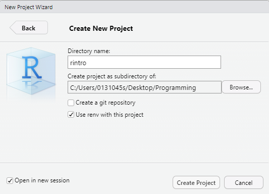
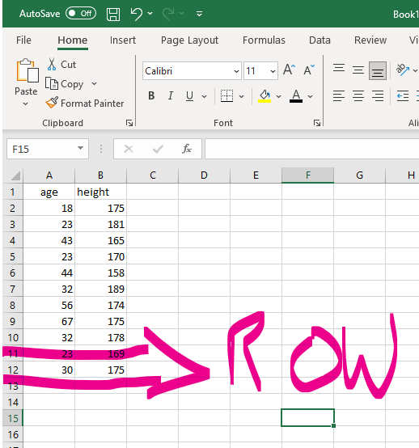

# Introduction

This set of workshops describes how to use R to import, clean, and process psychological data. All materials, data, and information in these workshops are used for educational purposes only. This document should only be shared within the University of Galway's School of Psychology and is not intended for widespread dissemination. The workshop's e-book is very much in its draft stages and will be updated and fine-tuned in the future. Several materials are adapted from various online resources on teaching R.

## Who is this resource for?

These workshops are designed to help people who come from a psychology or social science background learn the necessary programming skills to use R effectively in their research. These workshops are intended for individuals with no programming experience whatsoever, teaching the necessary programming skills and ideas required to conduct statistical techniques in psychology (e.g., Power Analyses, Correlation, ANOVA, Regression, Mediation, Moderation).

These workshops are **not** for people interested in learning about statistical theory or the who, what, where's of any of the aforementioned statistical techniques. I want these workshops to focus entirely on how to perform statistical analyses in R; I assume you know the rest or know how to access that information.

## Should I learn R?

There are many reasons to learn R.

Psychological research is increasingly moving towards open-science practices. One of the key principles of open-science is that all aspects of data handling - including data wrangling, pre-processing, processing, and output generation - are openly accessible. This is not only an abstract want or desire; several top-tier journals require that you submit R scripts along with any manuscripts. If you don't know how to use R (or at least no one in your lab does), then this will put you at a disadvantage.

R enables you to import, clean, analyze, and publish manuscripts from R itself. You do not have to switch between SPSS, Excel, and Word or any other software. You can conduct your statistical analysis directly in R and have that "uploaded" directly to your manuscript. In the long run, this will save you so much time and energy.

R is capable of more than statistical analysis. You can create websites, documents, and books in R. This workshop textbook was developed in R! While these initial workshops will not be discussing how to do this (although it is something that I would like to do in the future), I wanted to mention it as an example of how powerful R can be.

## What will I learn to do in R?

The following workshops will teach you how to conduct statistical analysis in R.

R is a statistical programming language that enables you to wrangle, process, and analyze data. By the end of these workshops, you should be able to import a data file into R, do some processing and cleaning, compute descriptive and inferential statistics, generate nice visualizations, and output your results.

The learning objectives of this course are:

-   Learn how to import and create datasets in R.
-   Learn and apply basic programming concepts such as data types, functions, and loops.
-   Learn key techniques for data cleaning in R to enable statistical analysis.
-   Learn how to create APA-standard graphs in R.
-   Learn how to deal with errors or bugs with R code.
-   Learn how to export data.

## What will I not learn to do in R?

This is not an exhaustive introduction to R. Similar to human languages, programming languages like R are vast and will take years to master. After this course, you will still be considered a "newbie" in R. But the material covered here will at least provide you a solid foundation in R, enabling you to go ahead and pick up further skills if required as you go on.

This course will teach you data cleaning and wrangling skills that will enable you to wrangle and clean a lot of data collected on Gorilla or Qualtrics. But you will not be able to easily handle all data cleaning problems you are likely to find out in the "wild" world of messy data. Such datasets can be uniquely messy, and even experienced R programmers will need to bash their head against the wall a few times to figure out a way to clean that dataset entirely in R. If you have a particularly messy dataset, you might still need to use other programs (e.g., Excel) to clean it up first before importing it to R.

Similarly, do not expect to be fluent in the concepts you learn here after these workshops. It will take practice to become fluent. You might need to refer to these materials or look up help repeatedly when using R on real-life datasets. That's normal.

This workshop is heavily focused on the tidyverse approach to R. The tidyverse is a particular philosophical approach to how to use R (more on that later). The other approach would be to use base R. This can incite violent debates in R communities on which approach is better. We will focus mainly on tidyverse and use some base R.

This workshop does not teach you how to use R Markdown. R Markdown is a package in R that enables you to write reproducible and dynamic reports with R that can be converted into Word documents, PDFs, websites, PowerPoint presentations, books, and much more. That will be covered in the intermediate workshop program.

## Where and when will the workshops take place?

The sessions will take place in **AMB-G035** (Psychology PC Suite). The schedule for the sessions is as follows:

-   Feb 7th: Introduction to R and RStudio
-   Feb 14th: Basic Programming (Part I)
-   Feb 21st: Basic Programming (Part II)
-   Feb 28th: Data Cleaning in R (Part I)
-   March 6th: Data Cleaning in R (Part II)
-   March 13th: Data Visualization
-   March 20th: Running Inferential Statistical Tests in R (Part I)
-   March 27th: Running Inferential Statistical Tests in R (Part II)

Each session is on a Wednesday and will run between 11:00 - 13:00.

## Are there any prerequisites for taking this course?

None at all. This course is beginner-friendly. You also do not need to purchase anything (e.g., textbooks or software).

## Do I need to bring a laptop to the class?

If you have a laptop that you work on, I strongly encourage you to bring it. That way, we can get R and RStudio installed onto your laptop, and you'll be able to run R outside of the classroom.

If you work with a desktop, don't worry. The lab space will have computers that you can sign in and work on and use R.

<!--chapter:end:index.Rmd-->

# Getting Started with R and RStudio {#rstudio}

This workshop introduces the programming language R and the RStudio application. Today, we will download both R and RStudio, set up our RStudio environment, and write and run our first piece of R Code. This will set us up for the rest of the workshops.

## What actually is R?

R is a statistical programming language that enables us to directly ask our computer to carry out tasks. Typically, when we use our computers, we do not speak to it directly; instead we interact with "translators" (i.e., applications like SPSS), via button-click interfaces, to speak to our computer on our behalf. Such interfaces record and translate our instructions to our computers, who then carry out the instructions and return the results to the application, which then translates those results back to us.

Applications like SPSS are convenient. They usually have a user-friendly button-click based interface and take away the heavy lifting of communicating with our computer. This makes them significantly easier to learn in the short term compared to programming languages.

However, these apps also limit what we can do. For example, base SPSS is functional when it comes to creating visualizations, but it is difficult make major changes to your graph (e.g., making it interactive). If we want to create such visualizations, we will likely need to look elsewhere for it. Similarly, we might also be financially limited in our ability to use such apps, as proprietary software like SPSS is not cheap ([it can cost between \$3830 - 25200 for a single licence depending on the version](https://www.ibm.com/products/spss-statistics/pricing))!

In contrast, R is a free, open-source statistical programming language that enables us to conduct comprehensive statistical analysis and create highly elegant visualizations. By learning R we can cut out the middle man.

```{r fig.cap = "BBC graphs created in R.", echo = FALSE, warning = FALSE}

library(knitr)

include_graphics("img/01-bbc.png")


```

But why should we learn R and not a different programming language? In contrast to other programming languages (Python, JavaScript, C), R was developed by statisticians. Consequently, R contains an extensive vocabulary to enable us to carry out sophisticated and precise statistical analysis. I have used R and Python to conduct statistical analysis and anytime I wanted to use a less frequently used statistical test, there was significantly more support and information on how to conduct that analysis in R than in Python. For such reasons, R is typically used among statisticians, social scientists, data miners, and bioinformaticians - and will be used in this course[^02-rstudio-1].

[^02-rstudio-1]: There are always tradeoffs in selecting a language. Many programming concepts are easier to grasp in Python than in R. Similarly, there is a lot of resources available for conducting machine-learning analysis in Python.

    But if you are goal is conduct data cleaning, analysis, visualization, and reporting, then R is a excellent choice. The good thing is that once you achieve a certain level of competency in one programming language, you will find it significantly easier to pick up a following one.

## Downloading R

Please follow the following instructions to download R on either Windows or Mac.

### Downloading R on Windows

1.  Go to the website: <https://cran.r-project.org/>
2.  Under the heading *Download and Install R,* click *Download R for Windows* {width="2804"}
3.  Click the hyperlink ***base*** or ***install R for the first Time***
4.  Click Download R-4.3.2 for Windows (depending on the date you accessed this, the version of R might have been been updated. That's okay, you can download newer versions). Let the file download. 
5.  Once the file has been downloaded, open it, and click "Yes" if you are asked to allow this app to make changes to your device. Then choose English as your setup language. The file name should be something like "R-4.3.2.-win". The numbers will differ depending on the specific version that was downloaded.
6.  Agree to the terms and conditions and select a place to install R. It is perfectly fine to go with the default option.

### Downloading R on Mac

The instructions are largely the same for Windows. Please see this guide for more information <https://teacherscollege.screenstepslive.com/a/1135059-install-r-and-r-studio-for-mac>

## Install and Open R Studio

Once R is installed, we will install RStudio.

RStudio is a front-end program that makes it it much more user-friendly to use R without sacrificing our ability to code in R. R Studio will enable us to write and save R code, generate plots, manage our files, and do other useful things. RStudio relationship to R is similar to the relationship between a basic text editor and Microsoft Word. We could write a paper in a text editor, but it is much quicker and more efficient to use Word.

1.  **NB:** Make sure that R is installed ***before*** trying to install R Studio.
2.  Go to the RStudio website: <https://posit.co/download/rstudio-desktop/>
3.  The website should automatically detect your operating system. Click the ***Download RStudio Desktop*** button. {width="690"}

Once the file is downloaded, open it and allow it to make changes to your device. Then follow the instructions to download the program. I recommend going with all default options here.

After downloading both R and RStudio, open RStudio on your computer. You do not have to open R as RStudio will work with R (if everything is working correctly).

When you first open RStudio, you will see three panes or "windows" in R Studio: "Console" (left) "Environment" (top right), and "Files" (bottom right).


## Creating an R Project

The first thing we will do in RStudio is create a *R Project*. R Projects are environments that will group together input files (e.g., data sets), analyses on those files (e.g., code), and any outputs (e.g., results or plots). Creating an R Project will set up a new directory (folder) on your computer. Any time you open that project, you are telling R to work within this particular directory.

***Activity***

Let's create an R Project that we will use during these workshops.

1.  Click "File" in the top left hand corner of RStudio-\> then click new "New Project"

2.  The "New Project Wizard" screen will pop up. Click "New Directory" -\> "New Project"

3.  In the "Create New Project" screen, there are four options.

**Option 1**: The "Directory name" options sets the name of the project and associated folder.

-   You can set this to whatever you want. ***Just don't set it to "R",*** as this can create problems down the line.

-   I ***recommend*** that you set the same directory name as me - ***introR_2024***

**Option 2**: The "Create project as sub-directory of" option selects a place to store this project on your computer.

-   You can save this anywhere else you like (e.g., your Desktop). Just make sure to save somewhere you can find and somewhere that will not change location (e.g., if you save folders to your desktop, but then tend to move them elsewhere once it gets cluttered, then do not save it to your desktop).

-   My recommendation would be to create a folder called "R_Programming" on your desktop. And then save your project in this folder.

-   Regardless of where you save your project, copy the location and paste it somewhere you can check (e.g., into a text file)

**Option 3**: The "Use renv with this project" option enables you to create a virtual environment for this project that will be separate to other R projects. Don't worry for now about what that means, it will be explained later on.

-   Tick this option.

**Option 4:** The "Open in new session" just opens a new window on RStudio for this project.

-   Tick this option.

You can see my example below. Once you're happy with your input for each option, click "Create Project" This will open up the project introR_2024.

```{r fig.cap = "New Project Set Up", echo = FALSE, warning = FALSE}

library(knitr)




```

### Navigating RStudio

In our new project, introR_2024, we are going to open the "Source" pane, which we will often use for writing code, and viewing datasets.

There are a variety of ways to open the Source pane.

**Button approach**: Click the "File" tab in the top-left hand corner (not the File pane) -\> Click "New File" -\> "R Script"


***Button Shortcut***: directly underneath the *File* tab, there is an icon of a white sheet with a green and white addition symbol. You can click that too.

**Keyboard Shortcut:** You can press "Ctrl" + "Shift" and "N" on Windows. Or "Cmd" + "Shift" + "N" on Mac.

Now you should see your four panes: Source, Console, Environment, and Files.


#### The RStudio Workspace

Now that we have each pane opened, let's briefly describe what each pane is for.

-   The ***Source Pane*** is where you will write R scripts. R scripts enable you to write, save, and run R code in a structured format. For example, you might have an R script titled "Descriptive" which contains the code you need to compute descriptive statistics on your data set. Similarly, you might have another R script titled "Regression" that contains the code for computing your regression analyses in R.

-   The ***Console Pane*** is where you can write R code or enter commands into R. The console is also where you can find several outputs from your R scripts. For example, if you create a script for running a t-test in R, then the results can be found in the Console Pane. You will also find any error or warning messages about any code that you run (e.g., if you make a mistake in your R code) highlighted in the console. In short, the console is where R is actually running.

-   The ***Environment Pane*** is where you will find information on any data sets and variables that you import or create in R within a bespoke R project. The "History" tab will contain a history of any R code that you run during the project. This pane is really useful for getting a bird-eye's view of a project (which can be really useful if you are returning to a project after a long period of time or you are looking at someone's else code).

-   The ***Files Pane*** is where you find your R project files (in the Files tab), the output of any plots that you create (Plots tab), the status of any downloaded packages (Packages tab), and information and helpful information about R functions and packages (Help).

Each pane will be used extensively during these workshops.

### Checking our Working Directory

Everytime you open up a project or file in RStudio, it is good practice to check the working directory. The working directory is the environment on our computer that R is currently operating in.

You want the working directory to be in the same location as your R project. That way any files you import into RStudio or any files you export (datasets, results, graphs) can easily be found in your R project folder. A lot of problems can be avoided in R by making sure that you check the working directory. To check the working directory, type the following into the console pane

```{r}
getwd()
```

What you get in return is the current working directory R is working in. Your working directory will not be the same as mine, that's perfectly normal. Just check to make sure that is in the same location you specified when you created your project (**Option 2**).

### Setting up a new Working Directory {#set_wd}

We are going to slightly change our working directory. In our R Project, we are going to create a folder for week1 of the workshop. Anything that we create in R will then be saved into this week1 folder.

-   Click "Session" on your RStudio toolbar -\> Set Working Directory -\> Choose Directory


-   By default you should be in your R Project (e.g., Rintro_2024).

-   Within this R Project, create a new folder and call it "week1"

-   Click "week1" and then click Open


You should see something like the following in your console

```         
> setwd("C:/Users/0131045s/Desktop/Programming/R/Workshops/Example/Rintro_2024/week1")
```

Check whether this is actually the location you want to store your files for this course. If it is, we are good to go. If not, then let me know.

## Writing our first R Code

Let's write our first line of R code in the ***console***. The R console uses the operator "\>" to indicate that it is ready for a new line of code.

Type in the each of the following instructions (after the ´\>´ operator) and press enter. Feel free to change the second line of code to add your own name.

```{r first piece of code}

print("Hello World")

print("My name is Ryan and I am learning to code in R")

```

Congratulations, you've written your first piece of code!

Let's describe what is going on here. We used a function called `print()` to print the words "Hello World" and "My name is Ryan and I am learning to code in R" in the console. Functions are equivalent to verbs in English language - they describe doing things. In this case, R sees the function print - then it looks inside the bracket to see what we want to print, and then it goes ahead and prints it. Pretty straightforward.

Functions are a very important programming concept, and there is a lot more going on under the hood than I have described so far - so we will be returning to functions repeatedly and filling you in with more information. But in essence functions are verbs that enable us to tell our computer to carry out specific actions on objects.

## Console vs Source Script

You might have noticed that I asked you to write code in the console rather than in the source pane. It's worth discussing here what the differences are between the console and the script when it comes to writing code.

The console is like the immediate chat with R. It's where you can type and execute single lines of code instantly. Imagine it as a friendly conversation where you ask R to do something, and it responds right away.  The console is great for experimenting and getting instant feedback. It's your interactive playground, perfect for spontaneous interactions with R.

The console is also really useful for performing quick calculations, testing functions or pieces of code, and for running code that should run once and only once.

However, the console is cumbersome to use if we want to write code that is several lines long and/or when we want to structure or save our code. This is where R scripts come in.

R scripts are text files where we can write R code in a structured manner. Scripts enable us to structure our code (e.g., with headings and instructions), write several pieces of code, and save and rerun code easily. If you think of your console as a draft, then your script is for the code that you want to keep.

From now on, whenever we write code, we are going to be using R scripts by default. For the times we will write code in the console, I will let you know beforehand.

## Let's write some statistical code

Okay we have talked a lot about R and RStudio. To finish off this session, let's write code that will take a data set, calculate some descriptive statistics, run an inferential test, generate a graph, and save our results. Don't worry if you do not understand any of the following code. Just follow along and type it yourself in the R script we opened up earlier (if it's not open, click "File" -\> "New File" -\> "RScript"). Once you have created this script, save it as "01-paired-t-tests".

When you download R, you will have automatic access to several functions (e.g., print) and data sets. One of these data sets are called sleep, which we are going to use right now. To learn more about the sleep data set, type `?sleep` into the console. You will find more information on the data sets in the Files pane, under the Help tab.

First let's have a look at the sleep data set by writing the following code in the R script. To run scripts in R, select the code you have written and click the Run button with the green arrow in the top right corner of the script.

```{r}

print(sleep) 

```

The `print()` function here prints out the sleep data set in the console. There are also other ways to view a data set, such as using the functions `head()`, `tail()` `View()`, and `str()`. Type these in the console (make sure to put `sleep` inside the brackets) and see what results you get.

The result of `print(sleep)` shows us there are 20 observations in the dataset (rows), with three difference variables (columns): extra (hours of extra sleep each participant had), group (which treatment they were taken), and ID (their participant ID).

Now let's calculate some descriptive statistics. One we can do this is by using the summary() function. This function takes in an an object (e.g., like a data set) and summaries the data. Write the following in your R script and press run.

```{r}

summary(sleep) 
```

Running `summary(sleep)` shows us descriptive statistics for each of our variables. We can see that the mean change in hours of sleep were +1.5, and that there was 10 participants within both the control and experimental condition.

But it's not exactly what we need. Firstly, we don't need summary descriptive on the participant ID. Secondly, it only tells us the mean the entire sample, whereas we want the mean score per each treatment group. To get this information we can use the `aggregate()` function, which enables us to split our data into subset and then compute summary statistics per group. Remember to press run after you written your code.

```{r}


#The code inside the aggregate bracket tells our computer to: 
# data = sleep -> Go to the sleep data set

#extra ~ group -> Take the variable "extra" and split it into subsets based on the variable "group"

# FUN = mean -> Apply the mean() function (FUN) on each subset 

aggregate(data = sleep, extra ~ group, FUN = mean)


```

That's more like it. Now we can see that there does seem to a difference between treatment1 and treatment2. Participants slept an extra 2.33 hours on average when taking treatment 2, whereas they only slept .75 hours (e.g., 45 minutes) more on average when taking treatment 1. So treatment 2 does seem more effective.

Let's run a paired-samples t-test to see if those differences are significant (I have assumed all parametric assumptions are correct).

```{r}

t.test(sleep$extra[sleep$group == 1], #this code extracts the group 1 scores
       sleep$extra[sleep$group == 2], # this code extracts group 2 scores
       paired = TRUE) #this code tells R to run a paired t-test, not between/independent t-test


```

Boom! We can see there is a statistically significant difference between the two groups. I know the code within the t-test might look a bit complicated, but we will break it down and explain it as we go on in further weeks.

Finally let's visualize our data with the plot() function.

```{r fig.cap="Generic Boxplot"}

plot(sleep$group, sleep$extra)
```

The plot() function is an example of a generic function, which means it's a function that will try to adapt to our code. In this case, the plot() function looks at the variables we wants to plot, and identifies that the box plot is the most appropriate way to plot it.

Now this plot is perfectly adequate for a first viewing, but let's make it a bit more instructive by adding labels to the x and y axis, and by adding a title to it.

```{r fig.cap="Generic Boxplot with appropriate labelling"}


#xlab = creates a label for the x-axis  

#ylab = creates a title for the y-axis  

#main = creates a title for the plot  


plot(sleep$group, sleep$extra, xlab = "Treatment", ylab = "Hours of Sleep", main = "Effect of Treament on Sleep Duration")  


```

Now let's take this plot and save it to a PDF so that we could share our results with others. The standard way of doing this in R is a bit cumbersome. We have to tell R that we are about to create a plot that we want to make into a PDF. Then we have to generate the plot. Then we have to tell R we are done with creating the PDF. We'll learn a MUCH simpler way to do this in future weeks, but this will do for now.

```{r}

pdf(file = "myplot.pdf") #Tells R that we will create a pdf file called "my_plot" in our working directory

plot(sleep$group, sleep$extra, xlab = "Treatment", ylab = "Hours of Sleep", main = "Effect of Treament on Sleep Duration")  #this will save the plot to our pdf


dev.off() #this tells R that we are done with adding stuff to our PDF

```

Go to the files pane, and open up the pdf "myplot.pdf". It should be in your working directory. Open it up the PDF and have a look at your graph[^02-rstudio-2].

[^02-rstudio-2]: This is a fairly generic type of graph offered by base R. During the course we will looking at ways we can create "sexier" and more APA friendly type of graphs. But for one line of code, it's not bad!

### Comments

Last concept before we finish. You might have noticed that I wrote several things with a `#` before them. These are known as comments. Comments are any piece of text that will be ignored by R (i.e., they will not be executed within the console). They are fundamental to writing clear code.

We create comments using `#` symbol. This symbol tells R to ignore whatever comes directly ***afterwards***.

There are various reasons for using comments.

```{r fig.cap = "Four Examples of Comments Use", echo = FALSE, warning = FALSE}

library(knitr)

include_graphics("img/03-comments.png")


```

In the above figure, you'll see four different types of comments.

1.  The first type of comment provides a quick introduction to the R script. It can be really useful here to provide a clear information on what this script is trying to do (e.g., run a paired samples t-test), what data it is working on (the sleep dataset), and who wrote or developed this script. This makes it significantly easier for anyone who might be reviewing your work or trying to apply your code to their own work to understand what is going on.

2.  The second type of comment structures the format of the script by providing headings or steps. Again, this just makes it easier to understand what is going on.

3.  The third type of comment is placed before the summary. This means that code `summary(sleep)` will not be executed in R. Why would we do this? If you remember last week, we wanted to compute the mean per each of our two treatment groups, which the summary function does not enable us to do, so it's not part of our main analysis. So why keep it? Well it still provides us with valuable information (e.g., mean, median, min, max for the entire sample), so rather than delete it, we'll just put a comment in front of it. And if anytime we want to check these descriptives, we can just remove the `#` and run that line of code.

4.  The fourth type of comment provides some context or information on what a specific line of code is doing, namely, what the `aggregate()` function does. Again, this is really useful, particularly if you are using functions that are now well known.

Comments are extremely useful for orientating yourself to code. My advice would be to comment as much as your code as you. Anyone who has coded will have experience the following situation - You spend days/weeks writing a piece of code to clean a messy data set and run a specialized type of analysis. Several months go by and you need to return to your data set (pesky reviewer #2 wants you change something). You open up your R script and you are ***completely lost***. You have written no comments, so you have to spend days trying to remember what each piece of code was trying to do.

If you comment a lot, it will save you so much heartache in the future. And it will help you understand various code concepts better if you can explain them while you are using them. So comment, comment, comment!

## Summary

There we have it! That completes our first session with R and RStudio. Today was more about getting to grips with the software R and RStudio, but we still got our first pieces of code written. Hopefully it's given you a tiny glimpse into what R can do.

In the next two sessions, we will learn basic programming concepts and how to import data in R.

<!--chapter:end:02-rstudio.Rmd-->

# Basic R Programming (Part I) {#programming1}

Today, we are going to explore fundamental programming concepts in R. By the end of this session, you should be capable of the following:

-   Running and troubleshooting commands in the R console.
-   Understanding different data types and when to use them.
-   Creating and utilizing variables.
-   Grasping data structures and how to construct them.
-   Loading R packages and utilizing their functions.

```{r echo=FALSE, warning=FALSE}

library(webexercises)

```

## Activity 1: Set up your Working Directory

It's good practice to set your working directory when you first open RStudio. Remember that the working directory is the location where we want to store any resulting data files or scripts that you'll work on in a session. Last week I showed you how to do this using [a button-and-click interface](#set_wd).

Using those instructions, create a folder called "Week2" in the `rintro` project folder and set it as your working directory. Use the ´getwd()´ to check that it has been set as your working directory. Your output should be something like this:

```{r eval = F}

> setwd("C:/Users/0131045s/Desktop/Programming/R/Workshops/Example/Rintro_2024/week2")

```

## Using the Console

In the previous chapter, I made a distinction between the script and the console. I said that the script was an environment where we would write and run polished code, and the R console is an environment for writing and running "dirty" quick code to test ideas, or code that we would run once.

That distinction is kinda true, but it's not completely true. In reality, when we write a script we are preparing ***commands*** for R to ***execute*** in the console. In this sense, the R script is equivalent to a waiter. We tell the waiter (script) what we want to order, and then the waiter hands that order to the chef (console).

It's important to know how to work the R console, even if we mostly use scripts in these workshops. We don't want the chef to spit into our food.

### Typing Commands in the Console

We can command the R console to perform calculations. When following along in RStudio, there's no need to type the `>` operator; it simply indicates that R is ready to execute a new command, which can be omitted for clarity.[^03-programming_p1-1]

[^03-programming_p1-1]: Including the "\>" is a pain when formatting this book, so I won't include "\>" in examples of code from this point forward.

```{r eval=FALSE}

> 10 + 20

[1] 30

```

```{r eval=FALSE}

> 20 / 10

[1] 2

```

When performing calculations in R, it's important to know that it follows the usual arithmetic convention of the order of operations (remember [BIMDAS - Bracets, Indices, Multiplication, Division, Addition, and Subtraction?](https://www.tes.com/en-ie/teaching-resource/bidmas-bodmas-bedmas-bimdas-pemdas-permdas-11154272#:~:text=%E2%80%A2%20BIMDAS%20%2D%20Brackets%2C%20Indices%2C,Multiplication%2C%20Division%2C%20Addition%2C%20Subtraction)).

```{r eval = FALSE}


> (20 + 10 / 10) * 4 

[1] 84

> ((20 + 10) / 10) * 4

[1] 12

```

You may have noticed that the output of each code line we entered starts with a **`[1]`** before the actual result. What does this mean?

This is how R labels and organizes its responses. Think of it as having a conversation with R, where every question you ask gets an answer. The square brackets with a number, like **`[1]`**, serve as labels on each response, indicating which answer corresponds to which question. This is R ***indexing*** its answer.

In all the examples above, we asked R questions that have only 1 answer, which is why the output is always **`[1]`**. Look what happens when I ask R to print out multiple answers.

```{r}

print(sleep$extra) #this will print out the extra sleep column in the sleep dataset we used last week

```

Here R tells us that the first answer (i.e., value) corresponds to `0.1`. The next label is [16], which tells us that the 17th answer corresponds to 5.5.

Now, you might wonder why it shows [16] and doesn't show any of the previous or following numbers. This is because R only prints out the index when a new row of data is needed in the console. If there were indexes for every single answer, it would clutter the console with unnecessary information. So R uses new rows as a method for deciding when to show us another index.

We'll delve deeper into indexing later in this session; it's a highly useful concept in R.

### Console Syntax (Aka "I'm Ron Burgundy?")

#### R Console and Typos

One of the most important things you need to know when you are programming, is that you need to type *exactly* what you want R to do. If you make a mistake (e.g., a typo), R won't attempt to decipher your intention. For instance, consider the following code:

```{r eval=F}

> 10 = 20

```

```{r error = TRUE, echo = FALSE}

10 = 20

```

R interprets this as you claiming that 10 equals 20, which is not true. Consequently, R panics and refuses to execute your command. Now any person looking at your code would guess that since `+` and `=` are on the same key on our keyboards, you probably meant to type `10 + 20`. But that's because we have a strong theory of mind, whereas programming languages do not.

So be exact with your code or else be [Ron Burgundy?](https://www.youtube.com/watch?v=X3zfP14pLxc).

On the grand scheme of mistakes though, this type of mistake is relatively harmless because R will tell us immediately that something is wrong and stop us from doing anything.

However, there are silent types of mistakes that are more challenging to resolve. Imagine you typed `-` instead of `+`.

```{r eval= FALSE}

> 10 - 20

[1] -10

```

In this scenario, R will runs the code and produces the output. This is because the code still makes sense; it is perfectly legitimate to subtract 20 away from 10. R doesn't know you actually meant to add `10` to `20`. All it can see is three objects `10`, `-`, and `20` in a logical order, so it executes the command. In this relationship, you're the one in charge.

In short calculations like this, it's clear what you've typed wrong. However, if you have a long block of connected code with a typo like this, the result can significantly differ from what you intended, and it might be hard to spot.

The primary way to check for these errors is to always review the output of your code. If it looks significantly different from what you expected, then this silent error may be the cause.

I am not highlighting these issues to scare you, it's just important to know that big problems (R code not running or inaccurate results) can often be easily fixed by tiny changes.

#### R Console and Incomplete Commands

I've been pretty mean to the console, but there are rare times it will be a good Samaritan. For example, if R thinks you haven't finished a command it will print out `+` to allow you to finish it.

```{r eval = FALSE}

> (20 + 10
 
+ )

[1] 30

```

So when you see "+" in the console, this is R telling you that something is missing. If nothing is missing, then this indicates that your code might not be correctly formatted. Overall, the moral of this section can be summarized as: proofread your code!

### Exercises

1.  Practice performing basic calculations in R console. Calculate the following:

-   25 multiplied by 4
-   72 divided by 8
-   30 multiplied by 4, and then divided by 2

1.  Imagine you want to calculate the average/mean of the following 5 numbers 15, 22, 18, 30, and 25. Use the R console to find the average.

2.  When I type this code into the R console, I get the `+` operator, how can I fix it?

```{r eval = FALSE}

> (60 / 100
   
+   

```

## Data Types

Our overarching goal for this course is to enable you to import your data into R, select the most relevant subset of data for analysis, conduct descriptive and statistical analysis, and create nice data visualizations. But it's important to consider ***What is data and how is it stored in R?***

Data comes in various forms: numeric (integers and decimal values) or alphabetical (characters or lines of text). R has developed a system for categorizing this range of data into different data types.

## Basic Data types in R

R has 4 basic data types that are used 99% of the time:

### Character

A character is anything enclosed within quotation marks. It is often referred to as a *string*. Strings can contain any text within single or double quotation marks.

```{r}

#we can use the class() function to check the data type of an object in R

class("a")

```

```{r}

class("cat")

```

Numbers enclosed in quotation marks are also recognised as character types in R.

```{r}

class("3.14") #recognized as a character
class("2") #recognized as a character
class(2.13) #not recognised as a character

```

### Numeric (or Double)

In R, the numeric data type represents all real numbers, with or without decimal value, such as:

```{r}

class(33)

class(33.33)

class(-1)

```

### Integer

An integer is any real whole number without decimal points. We tell R to specify something as an integer by adding a capital "L" at the end.

```{r}

class(33L)

class(-1L)

class(0L)

```

You might wonder why R has a separate data type for integers when numeric/double data types can also represent integers. The very techincal and boring answer is that integers consume less memory in your computer compared to the numeric or double data types. \``33 contains less information than 33.00`\`. So, when dealing with very large datasets (in the millions) consisting exclusively of integers, using the integer data type can save substantial storage space.

It's unlikely that you will need to use integers over numeric/doubles for your own research, but its good to be aware of just in case.

### Logical (otherwise know as Boolean)

The Logical data type has two possible values: **`TRUE`** and **`FALSE`**. In programming, we frequently need to handle conditions and make decisions based on whether specific conditions are true or false. For instance, did a student pass the exam? Is a p-value below 0.05?

The Logical data type in R allows us to represent and work with these true or false values.

```{r}


class(TRUE)

class(FALSE)

```

One important note is that it is case-sensitive, so typing any of the following will result in errors:

```{r eval = FALSE}

class(True)   # Error: object 'True' not found
class(False)  # Error: object 'False' not found
class(true)   # Error: object 'true' not found
class(false)  # Error: object 'false' not found

```

The distinction between data types in programming is crucial because some operations are only applicable to specific data types. For example, mathematical operations like addition, subtraction, multiplication, and division are only meaningful for numeric and integer data types.

```{r, eval=FALSE}
11.00 + 3.23 #will work

[1] 14.23


11 * 10 #will work

[1] 120

"11" + 3 # gives error

Error in "11" + 3 : non-numeric argument to binary operator

```

This is an important consideration when debugging errors in R. It's not uncommon to encounter datasets where a column that should be numeric is incorrectly saved as a character. If you intend to perform a statistical operation on such a column (e.g., calculating the mean), you would first need to convert it to the numeric data type using the **`as.numeric()`** function.

```{r}

as.numeric("22")


```

The following functions enable you to convert one data type to another:

```{r eval=FALSE}

as.character()  # Converts to character
as.integer()    # Converts to integer
as.logical()    # Converts to logical

```

## Variables

Until now, the code we've used has been disposable; once you type it, you can only view its output. However, programming languages allow us to store information in objects called ***variables.***

Variables are labels for pieces of information. Instead of running the same code to produce information each time, we can assign it to a variable. Let's say I have a character object that contains my name. I can save that character object to a variable.

```{r}

name <- "Ryan"

```

To create a variable, we specify the variable's name (**`name`**), use the assignment operator (**`<-`**) to inform R that we're storing information in **`name`**, and finally, provide the data (in this case, the string "Ryan"). Once we execute this code, every time R encounters the variable **`name`**, it will substitute it with "Ryan."

```{r}

print(name)

```

Some of you might have seen my email and thought, *"Wait a minute, isn't your first name Brendan? You fraud!"* Before you grab your pitchforks, yes, you're technically correct. Fortunately, we can reassign our variable labels to new information.

```{r}

name <- "Brendan" #please don't call me this

print(name)

```

We can use variables to store information for each data types.

```{r}

age <- 30L

height <- 175 #centimetre 

live_in_hot_country <- FALSE

print(age)

print(height)

print(live_in_hot_country)

```

```{r}


paste("My name is", name, "I am", age, "years old and I am", height, "cm tall. It is", live_in_hot_country, "that I was born in a hot country")


```

We can use variables to perform calculations with their information. Suppose I have several variables representing my scores on five items measuring Extraversion (labeled **`extra1`** to **`extra5`**). I can use these variable names to calculate my total Extraversion score.

```{r}

extra1 <- 1
extra2 <- 2
extra3 <- 4
extra4 <- 2
extra5 <- 3

total_extra <- extra1 + extra2 + extra3 + extra4 + extra5

print(total_extra)

mean_extra <-  total_extra/5

print(mean_extra)
```

Variables are a powerful tool in programming, allowing us to create code that works across various situations.

### What's in a name? (Conventions for Naming Variables)

There are strict and recommended rules for naming variables that you should be aware of.

**Strict Rules (Must follow to create a variable in R)**

-   Variable names can only contain uppercase alphabetic characters A-Z, lowercase a-z, numeric characters 0-9, periods **`.`**, and underscores **`_`**.

-   Variable names must begin with a letter or a period (e.g., **`1st_name`** or **`_1stname`** is incorrect, while **`first_name`** or **`.firstname`** is correct).

-   Avoid using spaces in variable names (**`my name`** is not allowed; use either **`my_name`** or **`my.name`**).

-   Variable names are case-sensitive (**`my_name`** is not the same as **`My_name`**).

-   Variable names cannot include special words reserved by R (e.g., if, else, repeat, while, function, for, in, TRUE, FALSE). While you don't need to memorize this list, it's helpful to know if an error involving your variable name arises. With experience, you'll develop an intuition for valid names.

**Recommended Rules (Best practices for clean and readable code):**

-   Choose informative variable names that clearly describe the information they represent. Variable names should be self-explanatory, aiding in code comprehension. For example, use names like "income," "grades," or "height" instead of ambiguous names like "money," "performance," or "cm."

-   Opt for short variable names when possible. Concise names such as **`dob`** (date of birth) or **`iq`** (intelligence quotient) are better than lengthy alternatives like **`date_of_birth`** or **`intelligence_quotient`**. Shorter names reduce the chances of typos and make the code more manageable.

-   However, prioritize clarity over brevity. A longer but descriptive variable name, like **`total_exam_marks`**, is preferable to a cryptic acronym like **`tem`**.

-   Avoid starting variable names with a capital letter. While technically allowed, it's a standard convention in R to use lowercase letters for variable and function names. Starting a variable name with a capital letter may confuse other R users.

-   Choose a consistent naming style and stick to it. There are three common styles for handling variables with multiple words:

    1.  **snake_case**: Words are separated by underscores (e.g., **`my_age`**, **`my_name`**, **`my_height`**). This is the preferred style for this course as it aligns with other programming languages.

    2.  **dot.notation**: Words are separated by periods (e.g., **`my.age`**, **`my.name`**, **`my.height`**).

    3.  **camelCase**: Every word, except the first, is capitalized (e.g., **`myAge`**, **`myName`**, **`myHeight`**).

For the purposes of this course, I recommend using **`snake_case`** to maintain consistency with my code. Feel free to choose your preferred style outside of this course, but always maintain consistency.


```{r}

library(quizdown)


question(
  type = "multiple_choice",
  text = "What is the capital of France?",
  answers = c("London", "Berlin", "Paris", "Madrid"),
  correct = "Paris"
)

```


## Data Structures

So we've talked about the different types of data that we experience in the world and how R classifies them. We've also talked about how we can store this type of data into variables. But in data analysis, we rarely work with individual variables. Typically we work with large collections of variables that have a particular order. For example, data sets are organised by rows and columns

This also holds true in R, which has several different types of ***data structures*** that organise and group together variables. Each data structure has specific rules and methods for creating or interacting with them. I'll briefly mention each data structure first, before we focus on two main data structures we'll use in this course: `vectors` and `data frames`.

### Vectors

The most basic and (probably) important data structure in R are ***vectors***. You can think of vectors as a list of data of R that are of the same data type.

For example, I could create a character vector with names of people in the class.

```{r}

rintro_names <- c("Gerry", "Aoife", "Liam", "Eva", "Owen", "Ciara")


print(rintro_names)

```

```{r}

is.vector(rintro_names) 

```

And I can create a numeric vector with their performance on the module.

```{r}

rintro_marks <- c(87, 91, 87, 90, 88, 89)

print(rintro_marks)

```

And I can create a logical vectors that describes whether or not they like R.

```{r}

rintro_satisfied <- c(TRUE, FALSE, T, F, F, T) #you can use T or F as shortcuts

print(rintro_satisfied)

```

Technically, we have been using vectors the entire class. Vectors can have as little as 1 piece of data.

```{r}

instructor <- "Ryan/Brendan"

is.vector(instructor)

```

*Activity*: Try create a vector with only integers. Call it "int_vector". Check whether you have successfully created this vector with the code `class(int_vector)`

However, we can't include multiple data types in the one vector. Going back to our numeric grades vector, look what happens when we try mix in grades as characters.

```{r}

rintro_marks <- c(87, "A1", 87, 90, 88, 89)


print(rintro_marks)
```

R has converted every element within the `rintro_marks` vector into a character. If R sees an object that is a vector, but sees that its elements belong to different data types, it will try and convert every element to one data type. This is a strict rule in R - a vector can only be created if ever single element (i.e., thing) inside that vector is of the same data type.

If we were to check the class of the `rintro_marks`, it will show us this conversion

```{r}

rintro_marks <- c(87, 91, 87, 90, 88, 89) #original numeric vector


class(rintro_marks)


rintro_marks <- c(87, "A1", 87, 90, 88, 89)


class(rintro_marks)

```

Remember how I mentioned that you might download a dataset with a column that has numeric data, but is actually recognized as characters in R? This is one scenario where that could happen. The person entering the data might have accidentally entered text into a cell within a data column. When reads this column, it sees the text, and then R converts the entire column into characters.

#### Working with Vectors

We can perform several types of operations on vectors to gain useful information.

**Numeric and Integer Vectors**

We can run functions on vectors. For example, we can run functions like `mean()`, `median`, or `sd()` to calculate descriptive statistics on numeric or integer-based vectors.

```{r}

rintro_marks <- c(87, 91, 87, 90, 88, 89) #original numeric vector

mean(rintro_marks)

median(rintro_marks)

sd(rintro_marks)

```

A useful feature is that I can sort my numeric and integer vectors based on their scores.

```{r}

sort(rintro_marks) #this will take the original vector and arrange from lowest to highest scores

```

The `sort()` function by default arranges from lowest to highest, but we can also tell it to arrange from highest to lowest.

```{r}

sort(rintro_marks, decreasing = TRUE) 

```

**Character and Logical Vectors**

We are more limited when it comes to operators with character and logical vectors. But we can use functions like `summary()` to describe properties of character or logical vectors.

```{r}


summary(rintro_names)


```

The `summary()` functions tells me how many elements are in the character vector (there are six names), whereas it gives me a breakdown of results for the logical vector.

#### Vector Indexing and Subsetting

A vector in R is like a list of items. To be more specifc, vectors in R are actually *ordered* list of items. Each item in that list will have a position (known as its index). When you create that list (i.e., vector), the order in which you input the items (elements) determines its position (index). So the first item is at index 1, the second at index 2, and so on. Think of it like numbering items in a shopping list.

```{r fig.cap = "Indexing for Numeric Vector", echo = FALSE, warning = FALSE}


library(knitr)

include_graphics("img/03-index_numeric.png")

```

```{r fig.cap = "Indexing for Character Vector", echo = FALSE, warning = FALSE}


library(knitr)

include_graphics("img/03-index-character.png")

```

```{r fig.cap = "Indexing for Logical Vector", echo = FALSE, warning = FALSE}

library(knitr)

include_graphics("img/03-index-logical.png")


```

This property in vectors mean we are capable of extracting specific items from a vector based on their position. If I wanted to extract the first item in my list, I can do this by using `[]` brackets.

```{r}

rintro_names[1]

```

Similarly, I could extract the 3rd element.

```{r}

rintro_marks[3]

```

Or I could extract the last element.

```{r}

rintro_satisfied[8]

```

This process is called subsetting. I am taking an original vector and taking a sub-portion of its original elements.

I can ask R even to subset several elements from my vector based on their position. Let's say I want to subset the 2nd, 4th, and 8th elements. I just need to use `c()` to tell R that I am subsetting several elements.

```{r}

rintro_names[c(2, 4, 8)]

```

```{r}

rintro_marks[c(2, 4, 8)]

```

```{r}

rintro_satisfied[c(2, 4, 8)]

```

If the elements you are positioned right next to each other on a vector, you can use `:` as a shortcut.

```{r}

rintro_names[c(1:4)] #this will extract the elements in index 1, 2, 3, 4

```

It's important to know however that when you perform an operation on a vector or you subset it, it does not actually change the original vector. For example, if you wanted to save the top three `rintro_marks`, the following code would not work:

```{r warning = FALSE, eval = FALSE}

sort(rintro_marks, decreasing = TRUE)


[1] 91 90 89 88 87 87

rintro_marks[c(1, 2, 3)]

[1] 87 91 87
print(rintro_marks)

[1] 87 91 87 90 88 89

```

You can see that neither the `sort()` function or subsetting actually changed the original vector. They just outputted a result to the R console. If I wanted to actually save their results, then I would need to assign them to a variable label.

Here's how I would extract and save the top three exam marks.

```{r}

marks_sorted <- sort(rintro_marks, decreasing = TRUE)

marks_top <- marks_sorted[c(1:3)]

print(marks_top)

```

Over to you! How could we extract and save the bottom 3 results from the `rintro_marks`\` vector? Give it a go.

Bonus Points: Calculate the mean of both the top 3 marks and bottom 3 marks.

#### Vectors - making it a little less abstract.

You might find the discussion of vectors, elements, and operations very abstract. I certainly did when I was was learning R. While the list analogy is helpful, it only works for so long - there's another data structure called `lists` (we'll talk it more next week). That confused me.

But what helped me understand vectors was the realization that a vector is simply a "line of data". Let's say I was running a study and collected data on participants age. When I open the excel file, there will be a column called "age" will all the ages of my participants. That column is a vector of data with the variable label "age".

Creating that vector is the equivalent of creating a column in excel.

```{r}

age <- c(18, 23, 43, 23, 44,32, 56, 67, 32, 23)

```

```{r echo = FALSE}

include_graphics("img/03-column-vector.png")

```

Similarly, rows are also lines of data going horizontally. If I add data to columns in Excel to a dataset, I am create a new row (line) of data. In R this is the equivalent of doing this:

```{r}
p11 <- c(30, 175)
```

```{r echo=FALSE}




```

So whenever you think of a vector, just remember that it refers to a line of data that would either be a column or a row.

So what happens we combine different vectors (columns and rows) together? We create a `data frame`.

### Data frames

Data frames is a rectangular data structure that is composed of rows and columns. A data frame in R is like a virtual table or a spreadsheet in excel.

```{r fig.cap = "The relationship between data frames and vectors. The different colours in the data frame indicate they are composed of independent vectors", warning = FALSE, echo = FALSE}

library(knitr)

include_graphics("img/03-dataframes_vectors.png")

```

Data frames are an excellent way to store and manage data in R because it can store different types data (e.g., character, numeric, integer) all within the same structure. Let's create such a data frame using the `data.frame()` function.

```{r}


my_df <- data.frame(
  Name = c("Alice", "Bob", "Charlie"), #a character vector
  Age = c(25L, 30L, 22L), #an integer vector
  Score = c(95.65, 88.12, 75.33) #a numeric vector
)

my_df

```

#### Selecting Data from a Data Frame

Once you have created or imported a data frame, you'll often need to access it and perform various tasks and analyses. Let's explore how to access data within a data frame effectively.

##### Selecting Columns

Columns in a data frame represent different variables or attributes of your data. Often in data analysis we want to select a specific column and then perform analyses on it. So how can we individual select columns? Well In a data frame, every column has a name, similar to how each column in an excel spreadsheet has a header. These columns names enable you to access and manipulate specific columns or variables within your data frame.

We select columns based on their names via two tools:

The **\$** Notation: You can use a dollar sign (\$) followed by the column to select ***an individual column*** in a data frame. For example, let's select the `Name` column in the `my_df` data frame.

```{r}

my_df$Name

```

**Square Brackets** `[]`: This is similar approach to accessing elements from a vector. Inside the brackets you can specify both the row and columns that you want to extract. The syntax for selecting rows and columns is: `the dataframe[the rows we want, the columns we want]`.

So if we wanted to access the "Age" column of my_df, we could run the following code:

```{r}

my_df[, "Age"]

```

You'll notice that we left the "rows" part empty in the square brackets. This tells R "keep all the rows for this column".

We can also use this approach to access multiple columns using the `c()` function.

```{r}

my_df[, c("Age", "Score")]

```

##### Selecting Rows

Rows in a data frame represent individual observations or records. You can access rows using indexing, specifying the row number you want to retrieve, following the syntax: `the dataframe[the rows we want, the columns we want]`.

To get the first row of your data frame (my_df), you can type the following.

```{r}
my_df[1, ]
```

This time I left the columns part blank, this tells R "please keep all the columns for each row".

To access the third row:

```{r}
my_df[3, ]
```

If you want multiple rows, you can use the \`c()\` function to select multiple rows. Let's select the 1st and 3rd row.

```{r}

my_df[c(1, 3), ]

```

If you wanted to select a range of rows, you can use the \`:\` operator:

```{r}
my_df[2:4, ]
```

These methods allow you to extract specific rows or subsets of rows from your data frame.

##### Selecting Rows and Columns

We can also select both rows and columns using `[]` and our syntax: `the dataframe[the rows we want, the columns we want]`.

For example we could select the first and third rows for the `Age` and `Score` columns.

```{r}

my_df[c(1,3), c("Age", "Score")]
```

Similar to when we indexed vectors, this won't change the underlying data frame. To do that, we would need to assign the selection to a variable.

```{r}

my_df2 <- my_df[c(1,3), c("Age", "Score")]

my_df2

```

#### Adding Data to your Data Frame

##### Adding Columns

You may often need to add new information to your data frame. For example, we might be interested in investigating the effect of `Gender` on the `Score` variable. The syntax for creating a new data frame is very straight forward

```{r eval = FALSE, warning = FALSE}

existing_df$NewColumn <- c(Value1, Value2, Value3)

```

Using this syntax, let's add a Gender column to our `my_df` dataframe.

```{r}

my_df$Gender <- c("Female", "Non-binary", "Male")

#let's see if we have successfully added a new column in

my_df

```

Let's say I noticed I mixed up the genders, and that Bob is Male and Charlie is Non-Binary. Just like we can rewrite a variable, we can also rewrite a column using this approach.

```{r}

my_df$Gender <- c("Female", "Male", "Non-binary")

#let's see if we have successfully rewritten the Gender Column

my_df

```

##### Adding Rows

What about if we recruited more participants and wanted to add them to our data frame (it is pretty small at the moment!) This is slightly more complicated, especially when we are dealing with data frames where each column (vector) is of a different data type.

What we need to do is actually creating a new data frame that has the same columns as our original data frame. This new data frame will contain the new row(s) we want to add.

```{r}

new_row <- data.frame(Name = "John", Age = 30, Score = 77.34, Gender = "Male")

```

Then we can use the `rbind()` function to add the new row to your original data frame. `rbind` takes in two data frames and combines them together. The syntax is as follows:

```{r}

my_df <- rbind(my_df, new_row)

my_df
```

### Exercises - Data Structures

1.  Create one vector of each data type:

    1.  Create a character vector called `friends` with the name of 3 of your friends.

    2.  Create an integer vector called `years` that describes the amount of years you have been friends (if it's less than 1 year, put 1).

    3.  Create a numeric vector called `extra` with their extraversion scores (out of 5).

    4.  Create a logical vector called `galway` that describes whether they live (`TRUE`) or don't live (`FALSE`) in Galway.

    5.  Once you have created each vector, check whether it is the correct data type using the `class()` function.

2.  Index the 2th, 4th, and 6th element for each of the following vectors.

    ```{r}

    vect1 <- c("Not this", "This", "Not This", "This", "Not This", "This")

    vect2 <- c(0, 1, 0, 1, 0, 1)

    vect3 <- c("FALSE", "TRUE", "FALSE", "TRUE", "FALSE")

    ```

3.  Write code that adds a column to the `my_df` data frame called `Nationality`. The values for the column should be `"Irish"`, `"American"`, `"English"`, `"Irish"`.

```{r echo = FALSE}

my_df$Nationality = c("English", "American", "Irish", "Irish")
```

4.  Check whether that Nationality column has been successfully added by using the \`\$\` notation. The output should look like this.

```{r echo = FALSE}

my_df$Nationality

```

5.  What code could you write that would take the \`my_df\` data frame and give you this output?

```{r echo = FALSE}

my_df[my_df$Gender != "Male", c("Name", "Age", "Nationality")]

```

6.  Write code that adds a row to the `my_df` data frame with your information for each of the columns (e.g., my data would be: `"Ryan"`, `30L`, `100`, `"Male"`). The `score` variable is a fake exam, so give yourself whatever score you want!

```{r echo = FALSE}

my_df[my_df$Gender != "Male", c("Name", "Age", "Nationality")]


```

## Summary

That concludes this session. Well done, we did a lot of work today. We learnt more about the relationship between the console and the script, and how we need to be precise when writing commands. We introduced the different types of data that R stores and how those data types can be stored in single lines of data in vectors or combined together to a table in a `data frame`.

Don't feel like you need to have mastered or even remember all the material that we covered today. Even though these concepts are labelled as "basic", that does not mean they are intuitive. It will take time for them to sink in and that's normal. We'll drill these concepts a bit further next week. We'll also learn how to import `data frames`, which will set us up nicely for working with real-life data sets.

<!--chapter:end:03-programming_p1.Rmd-->

