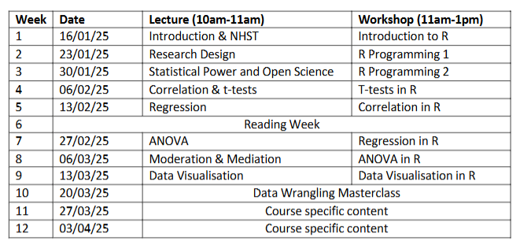

# **Overview**

**Authors:** Dr Ryan Donovan and Dr Ciara Egan.

This is the textbook for the Advanced Research Methods module (PS6183).
This textbook will describe how to use R programming language to import, clean, process, and visualize psychological data.
No prior knowledge of R or any other programming language or statistical software is required to successfully complete this module.
This textbook is still undergoing development and is not the final product.
Consequently, all textbook materials are used for educational purposes only and should only be shared within the University of Galway's School of Psychology.
Any issues or errors with the textbook should be reported to Ryan Donovan (ryan.donovan\@universityofgalway.ie).

## What will I learn in R?

In terms of specific R skills, students will learn how to:

-   Import, export, and create datasets.

-   Use basic programming concepts such as data types, functions, and loops.

-   Apply key techniques for data cleaning to enable statistical analysis.

-   Run descriptive and inferential statistics.

-   Create APA-standard graphs.

-   Deal with errors or bugs with R code.

## What will I not learn to do in R?

This is not an exhaustive introduction to R.
Similar to human languages, programming languages like R are vast and will take years to master.
After this course, you will still be considered a "newbie" in R.
But the material covered here will at least provide you a solid foundation in R, enabling you to go ahead and pick up further skills if required as you go on.

This course will teach you data cleaning and wrangling skills that will enable you to wrangle and clean a lot of data collected on Gorilla or Qualtrics.
But you will not be able to easily handle all data cleaning problems you are likely to find out in the "wild" world of messy data.
Such datasets can be uniquely messy, and even experienced R programmers will need to bash their head against the desk a few times to figure out a way to clean that dataset entirely in R.

Similarly, do not expect to be fluent in the concepts you learn here after these workshops.
It will take practice to become fluent.
You might need to refer to these materials or look up help repeatedly when using R on real-life datasets.
That's normal - so do not be discouraged when it happens.

This textbook mainly uses the tidyverse approach to R.
The tidyverse is a particular philosophical approach to how to use R (more on that later).
The other approach would be to use base R.
This can incite violent debates in R communities on which approach is better.
We will focus mainly on tidyverse and use some base R.

This textbook does not teach you how to use R Markdown.
R Markdown is a package in R that enables you to write reproducible and dynamic reports with R that can be converted into Word documents, PDFs, websites, PowerPoint presentations, books, and much more.
There are a lot of excellent resources available to learn how to use R markdown, but it's far more important to learn how to use R first.

## Why are we learning R?

There are many reasons to learn R.

Psychological research is increasingly moving towards open-science practices.
One of the key principles of open-science is that all aspects of data handling - including data wrangling, pre-processing, processing, and output generation - are openly accessible.
This is not only an abstract want or desire; several top-tier journals require that you submit R scripts along with any manuscripts.
If you don't know how to use R (or at least no one in your lab does), then this may put you at a disadvantage.

R enables you to import, clean, analyse, and publish manuscripts from R itself.
You do not have to switch between SPSS, Excel, and Word or any other software.
You can conduct your statistical analysis directly in R and have that "uploaded" directly to your manuscript.
In the long run, this will save you so much time and energy.

R is capable of more than statistical analysis.
You can create websites, documents, and books in R.
This e-book was developed in R!
We will talk more in class about the advantages of using R over existing propriety statistical software.

## Where and when will the classes take place?

The sessions will take place in **AMB-G035** (Psychology PC Suite).
The schedule for the sessions is as follows:

## Do I need to bring a laptop to the class?

If you have a laptop that you work on, please bring it.
That way, we can get R and RStudio installed onto your laptop, and you'll be able to run R outside of the classroom.

If you work with a desktop, don't worry.
The lab space will have computers that you can sign in and work on and use R.

## Office Hours (R Support - Ryan Donovan)

Programming concepts can sometimes take a while to sink in.
If you would like specific R support or help, then please feel free to see me during office hours.
Do not be a silent martyr.

+-------------------------------------+------------------------------------------------------+-------------------------------------------------------------------------------------------------------------------------------------------------------------------------------------------------------------------------------------------------------------------------------+
| Staff Member                        | Office Hours                                         | Location                                                                                                                                                                                                                                                                      |
+-------------------------------------+------------------------------------------------------+-------------------------------------------------------------------------------------------------------------------------------------------------------------------------------------------------------------------------------------------------------------------------------+
| Ryan Donovan                        | Wednesdays, 2.30-3.30pm.                             | 2065A, which is on the top floor of the Psychology building. It is in the corridor right next to the elevator.                                                                                                                                                                |
|                                     |                                                      |                                                                                                                                                                                                                                                                               |
| ryan.donovan\@universityofgalway.ie | (In-person or online option).                        | Teams Link: [click here](https://teams.microsoft.com/l/meetup-join/19%3ameeting_NDQ1YjRiNmQtNDQ4MC00NjgzLWIwYTQtNWI5OTg3ZmE1NWRj%40thread.v2/0?context=%7b%22Tid%22%3a%2213e3b186-c446-4aab-9c6d-9ab9bb76816c%22%2c%22Oid%22%3a%22c088ea08-9d92-460e-8972-64cd26bc4899%22%7d) |
|                                     |                                                      |                                                                                                                                                                                                                                                                               |
|                                     | Time does not suit?                                  |                                                                                                                                                                                                                                                                               |
|                                     |                                                      |                                                                                                                                                                                                                                                                               |
|                                     | Just get in touch, we can arrange a different time.  |                                                                                                                                                                                                                                                                               |
+-------------------------------------+------------------------------------------------------+-------------------------------------------------------------------------------------------------------------------------------------------------------------------------------------------------------------------------------------------------------------------------------+
